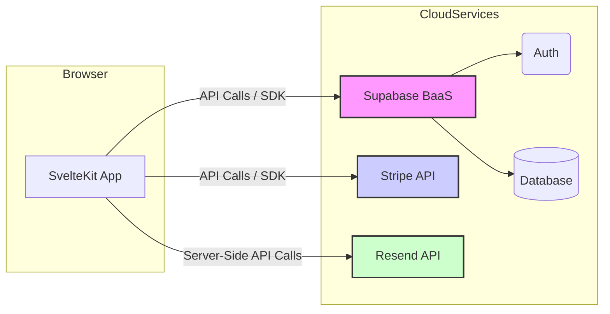

# System Patterns: Funding Finder (Based on CMSaasStarter Template)

## 1. Architecture Overview

The project follows a **Monolithic Frontend** architecture combined with a **Backend-as-a-Service (BaaS)** model.

- **Frontend:** SvelteKit handles routing, rendering (SSR/CSR), and the user interface. It's monolithic in the sense that the marketing site, blog, and user account sections are all part of the same SvelteKit application.
- **Backend:** Supabase provides core backend functionalities:
  - **Authentication:** Manages user sign-up, sign-in, sessions.
  - **Database:** Postgres database for storing application data (users, profiles, potentially funding data, saved searches, etc.).
- **Third-Party Services:**
  - **Stripe:** Integrated for handling subscription payments and billing management.
  - **Resend:** Used for sending transactional emails (welcome, password reset, etc.).

## 2. Key SvelteKit Patterns

- **File-based Routing:** Routes are defined by the directory structure within `src/routes/`.
- **Layouts:** Shared UI structures are implemented using `+layout.svelte` files (e.g., `src/routes/(marketing)/+layout.svelte`, `src/routes/(admin)/account/+layout.svelte`). Layouts can be nested.
- **Route Groups:** Parentheses `()` are used to group routes without affecting the URL path (e.g., `(marketing)`, `(admin)`), primarily for applying different layouts or logic.
- **Server Load Functions (`+page.server.ts`, `+layout.server.ts`):** Used to fetch data securely on the server before a page or layout is rendered. Often interact with Supabase.
- **Universal Load Functions (`+page.ts`, `+layout.ts`):** Run on both server and client. Used for fetching data that doesn't require secrets or for logic needed in both environments.
- **Form Actions (`+page.server.ts`):** Handle form submissions securely on the server. These are defined as named functions within an `actions` object (e.g., `updateProfile`, `submitContactUs`) and targeted by forms using `action="?/actionName"`. Forms often use SvelteKit's `use:enhance` directive for a smoother experience. Actions validate input, interact with the database, and return success data or validation errors via `fail()`.
- **API Routes (`+server.js`/`+server.ts`):** Create dedicated API endpoints within the SvelteKit application (e.g., `src/routes/(marketing)/auth/callback/+server.js`, `src/routes/(marketing)/search/api.json/+server.ts`).
- **Server Hooks (`src/hooks.server.ts`):** Intercept requests on the server to implement cross-cutting concerns like authentication handling (integrating with Supabase SSR).

## 3. Authentication & Authorization

- **Provider:** Supabase Auth.
- **UI:** `@supabase/auth-ui-svelte` provides pre-built components for login/signup forms (configured in `(marketing)/login/login_config.ts`).
- **Session Management:**
  - Handled by Supabase SDK and `@supabase/ssr` helpers.
  - Crucially, `src/hooks.server.ts` intercepts requests, initializes Supabase clients (including a secure service role client), and uses a `safeGetSession` helper to verify the session cookie with Supabase Auth.
  - Valid session and user data are stored in `event.locals` (e.g., `event.locals.session`, `event.locals.user`, `event.locals.supabase`, `event.locals.supabaseServiceRole`) for use in subsequent server load functions or actions.
- **Authorization:**
  - **Route Guarding:** Primarily managed through server load functions (`+layout.server.ts` or `+page.server.ts`) within protected route groups (like `(admin)`). These functions check `event.locals.session` and redirect unauthenticated users (e.g., `redirect(303, '/login')`).
  - **Database Security:** Relies heavily on Supabase Row Level Security (RLS) policies defined in SQL migrations (`supabase/migrations/`). These policies ensure users can typically only access or modify their own data, even when using the standard Supabase client. Server actions requiring broader access use the `supabaseServiceRole` client available in `event.locals`.

## 4. Data Management

- **Database:** Supabase Postgres. Schema defined and managed via SQL migrations (`supabase/migrations/`).
- **Data Access:** Primarily through the Supabase JavaScript client library (`@supabase/supabase-js`) in server load functions and form actions.
- **Type Safety:** `DatabaseDefinitions.ts` likely generated (e.g., via Supabase CLI) to provide TypeScript types for database tables, improving developer experience and reducing errors.
- **Funding Data (Initial):** Will be ingested from external files (CSV, Excel, etc.) and likely stored in the Supabase database for querying by the application. Requires data cleaning and structuring.

## 5. Styling & UI

- **Framework:** TailwindCSS for utility classes.
- **Component Library:** DaisyUI provides pre-styled components built on Tailwind.
- **Custom Styles:** Global styles in `src/app.css`, component-specific styles within `<style>` tags in `.svelte` files (scoped by default).

## 6. Static Content & Prerendering

- **Prerendering:** Public-facing pages (homepage, pricing, blog) use `export const prerender = true;` in their `+page.ts` or `+layout.ts` files. This generates static HTML during build time, improving performance and SEO.
- **Blog System:**
  - Blog post metadata (title, description, date, URL slug) is defined in `src/routes/(marketing)/blog/posts.ts`.
  - Actual content lives in Svelte components within `src/routes/(marketing)/blog/(posts)/` (e.g., `example_blog_post/+page.svelte`).
  - This file-based approach avoids the need for a database for public content.
- **Static Assets:** Images and other static files are stored in the `static/` directory and served directly.

## 7. Background Tasks / Data Processing (Potential)

- **Initial Data Ingestion:** Requires scripts or processes to parse crawled data (CSV, HTML, PDF) and load it into the Supabase database. This might be done manually initially or via custom scripts.
- **Data Updates:** Roadmap mentions automated crawling/updating. This will require separate processes or scheduled functions (e.g., Supabase Edge Functions, external cron jobs) to fetch new data, process it, and update the database.
- **Static Content Search Indexing:**
  - A custom Vite plugin (`vite.config.ts`) triggers `src/lib/build_index.ts` after the SvelteKit build completes (`writeBundle` hook).
  - `build_index.ts` scans the pre-rendered HTML output (`.svelte-kit/output/prerendered/pages`), extracts text content, and uses Fuse.js to build an optimized search index.
  - The index and raw data are saved to a static JSON file (`.svelte-kit/output/client/search/api.json`).
- **Client-Side Search:**
  - The `/search` page (`src/routes/(marketing)/search/+page.svelte`) fetches the static `search/api.json` file on load.
  - It initializes Fuse.js in the browser using the fetched index.
  - Searches are performed entirely client-side using `fuse.search()`, providing instant results without backend calls.

## 8. Stripe Billing & Subscriptions

- **Pricing Plans:** Defined in `src/routes/(marketing)/pricing/pricing_plans.ts`, linking internal plan IDs to Stripe's Product and Price IDs.
- **Customer Mapping:** The `stripe_customers` table in Supabase maps application users to Stripe Customer IDs.
- **Helper Functions (`subscription_helpers.server.ts`):**
  - `getOrCreateCustomerId`: Checks if a user already has a Stripe Customer ID; if not, creates one in Stripe and stores the mapping.
  - `fetchSubscription`: Retrieves a user's current subscription status from Stripe.
- **Checkout Flow:**
  - User selects a plan, triggering a request to `/account/subscribe/[stripe_price_id]`.
  - Server creates a Stripe Checkout Session (using the secret Stripe API key).
  - User is redirected to Stripe's hosted checkout page.
  - After payment, Stripe redirects back to the application.
- **Billing Portal:**
  - For managing existing subscriptions, the application creates a Stripe Billing Portal session.
  - User is redirected to Stripe's hosted portal for updating payment methods, viewing invoices, or canceling.
- **Security:** All Stripe API interactions happen server-side (in `.server.ts` files), keeping the API key secure.

## 9. Email Handling

- **Service:** Resend, a third-party email delivery service, handles the actual sending of emails.
- **Helper Functions (`src/lib/mailer.ts`):**
  - `sendAdminEmail({ subject, body })`: Sends simple text emails to the administrator address configured in `.env`.
  - `sendUserEmail({ user, subject, template_name, template_properties })`: Sends templated emails to users with important verification checks.
  - `sendTemplatedEmail()`: Core function that processes templates and sends via Resend.
- **Email Verification & Preferences:**
  - `sendUserEmail` performs critical checks before sending:
    - Verifies the user's email is confirmed (using Supabase Admin API).
    - Checks if the user has unsubscribed (via the `unsubscribed` flag in their profile).
  - This ensures compliance with email regulations and respects user preferences.
- **Templates:** Handlebars (`.hbs`) templates in `src/lib/emails/` provide both HTML and plain text versions:
  - `welcome_email_html.hbs`: HTML version with formatting.
  - `welcome_email_text.hbs`: Plain text fallback.
  - Templates use placeholders like `{{companyName}}` that are filled with data from `template_properties`.
- **Security:** All email sending happens server-side (in form actions or server functions), keeping the Resend API key secure.
