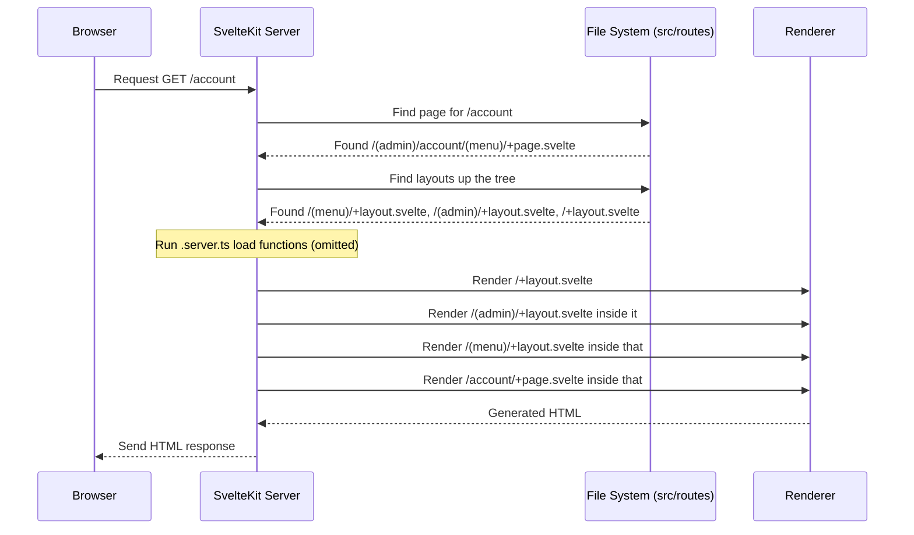

# Chapter 1: SvelteKit Routing & Layouts

Welcome to the `CMSaasStarter` project! This tutorial will guide you through building a Software as a Service (SaaS) application using SvelteKit, Supabase, and other modern web technologies.

Let's start with the very foundation: how do we create different pages in our application, and how do we give them a consistent look and feel? This is where SvelteKit's **Routing and Layouts** come in.

## What's the Big Idea?

Imagine you're building a house. You need different rooms for different purposes: a living room, a kitchen, bedrooms. You also need shared structures like hallways, the roof, and maybe the exterior walls that are common to many rooms.

Web applications are similar. We need:

1.  **Different Pages:** A homepage, a pricing page, an account settings page, a blog post page, etc. Each has unique content.
2.  **Consistent Structure:** We often want the same header (with the logo and navigation links) and footer on almost every page. Or perhaps a sidebar menu for all account-related pages.

SvelteKit solves this with a clever system built directly into your project's folder structure.

**Use Case:** Let's say we want our app to have:

- A public-facing **Homepage** (`/`) with a main navigation bar and footer.
- A public-facing **Pricing** page (`/pricing`) that shares the _same_ navigation bar and footer as the homepage.
- A private **Account Dashboard** page (`/account`) that has a _different_ layout, maybe with a sidebar menu, accessible only after logging in.

SvelteKit's Routing and Layouts make this easy to organize.

## Key Concepts

### 1. File-Based Routing (`src/routes`)

SvelteKit figures out the pages of your website by looking at the folders and files inside the `src/routes` directory. It's like a map of your website automatically generated from how you organize your files.

- A folder generally creates a URL path segment.
  - `src/routes/about` corresponds to the URL `/about`.
  - `src/routes/account/settings` corresponds to the URL `/account/settings`.
- The root of your site (`/`) corresponds to the `src/routes` directory itself.

### 2. Page Content (`+page.svelte`)

To define the actual content of a specific page, you create a file named `+page.svelte` inside the corresponding folder.

- `src/routes/+page.svelte`: Content for the homepage (`/`).
- `src/routes/about/+page.svelte`: Content for the `/about` page.
- `src/routes/account/settings/+page.svelte`: Content for the `/account/settings` page.

Think of `+page.svelte` as the unique furniture and decorations _inside_ a specific room (URL path).

```svelte
<!-- src/routes/about/+page.svelte -->
<h1>About Our Company</h1>
<p>We are dedicated to making awesome software!</p>
```

This simple Svelte component defines what users see when they visit `/about`.

### 3. Shared Structure (`+layout.svelte`)

Now, how do we add that consistent header and footer? We use a `+layout.svelte` file. A layout file wraps around the page content (`+page.svelte`) and any layouts further down the folder tree.

- Place `+layout.svelte` in a folder, and it applies to all pages within that folder _and its subfolders_.
- It acts like the common structure of your house section – the walls, ceiling, and floor that contain the room (`+page.svelte`).

A layout file _must_ include a way to render its "child" content (either the `+page.svelte` or a nested `+layout.svelte`). In modern Svelte (using Runes, which `CMSaasStarter` uses), this is often done with `{@render children?.()}`. In older SvelteKit versions, you'd see `<slot />`.

```svelte
<!-- src/routes/+layout.svelte (Simplified Root Layout) -->
<script lang="ts">
  // Import global styles
  import "../app.css"

  // This tells Svelte where to put the content of the page
  // or the content of a more specific layout.
  interface Props {
    children?: import("svelte").Snippet
  }
  let { children }: Props = $props()
</script>

<header>
  <nav>
    <a href="/">Home</a>
    <a href="/about">About</a>
    <a href="/pricing">Pricing</a>
    <a href="/account">My Account</a>
  </nav>
</header>

<main>
  <!-- The actual page content (+page.svelte or nested layout) goes here! -->
  {@render children?.()}
</main>

<footer>
  <p>&copy; 2024 Your Awesome Company</p>
</footer>
```

In this example:

1.  We import global CSS (`app.css`).
2.  We define a standard HTML structure with `<header>`, `<main>`, and `<footer>`.
3.  The `{@render children?.()}` part is the crucial placeholder where the specific page's content (from `+page.svelte`) or a nested layout will be injected.

If you put this file in `src/routes/+layout.svelte`, _every_ page on your site will automatically get this header and footer, unless a more specific layout in a subfolder overrides it.

### 4. Server-Side Logic (`+page.server.ts`, `+layout.server.ts`)

Sometimes, you need to fetch data or run code on the server _before_ a page or layout is rendered. SvelteKit uses files ending in `.server.ts` (or `.server.js`) for this.

- `+page.server.ts`: Server-side code specific to a page.
- `+layout.server.ts`: Server-side code specific to a layout and the pages/layouts it contains.

These files often contain `load` functions. We won't dive deep into these here, but know they are used for things like fetching user data, checking permissions, or getting blog post content from a database _before_ showing the page. You'll learn more about this when we cover [Supabase Integration (Auth & Database)](02_supabase_integration__auth___database__.md) and [Server Hooks & API Endpoints](06_server_hooks___api_endpoints_.md).

### 5. Layout Groups (`(group_name)`)

Remember our use case? We wanted the public pages (`/`, `/pricing`) to have one layout, and the private account pages (`/account`) to have a _different_ layout (e.g., with a sidebar). But we don't want the URL to become `/marketing/` or `/admin/account`.

SvelteKit lets us group routes using folders wrapped in parentheses, like `(marketing)` or `(admin)`. These folders **do not** add segments to the URL path. They purely exist to organize your code and apply specific layouts to sections of your site.

Here's how `CMSaasStarter` uses them:

```
src/
└── routes/
    ├── (marketing)/       <-- Public pages group (no '/marketing' in URL)
    │   ├── +layout.svelte   <-- Layout for marketing pages (e.g., Navbar, Footer)
    │   ├── +page.svelte     <-- Homepage -> renders at '/'
    │   ├── blog/
    │   │   └── ... blog pages and layout ...
    │   ├── pricing/
    │   │   └── +page.svelte <-- Pricing page -> renders at '/pricing'
    │   └── login/
    │       └── ... login page and layout ...
    │
    ├── (admin)/           <-- Private/logged-in pages group (no '/admin' in URL)
    │   ├── +layout.svelte   <-- Base layout for admin (checks login - see layout.ts)
    │   ├── account/
    │   │   ├── (menu)/        <-- Sub-group for pages *with* the sidebar menu
    │   │   │   ├── +layout.svelte <-- The actual sidebar menu layout
    │   │   │   ├── +page.svelte   <-- Account dashboard -> '/account'
    │   │   │   ├── billing/
    │   │   │   │   └── +page.svelte <-- Billing page -> '/account/billing'
    │   │   │   └── settings/
    │   │   │       └── +page.svelte <-- Settings page -> '/account/settings'
    │   │   ├── create_profile/
    │   │   │    └── +page.svelte <-- Special page *without* the sidebar -> '/account/create_profile'
    │   │   └── sign_out/
    │   │        └── +page.server.ts <-- Action to sign out -> '/account/sign_out'
    │
    ├── +layout.svelte     <-- Root layout (applies to everything, very basic)
    └── +error.svelte      <-- Optional: Default error page
```

- Pages like the homepage (`/`) and pricing (`/pricing`) are inside `(marketing)`. They will use `src/routes/(marketing)/+layout.svelte`.
- Pages like the account dashboard (`/account`) and settings (`/account/settings`) are inside `(admin)`. They will _first_ use `src/routes/(admin)/+layout.svelte` (which might handle authentication checks via its `+layout.server.ts`), and then the pages inside `(menu)` will _also_ use `src/routes/(admin)/account/(menu)/+layout.svelte` (which provides the sidebar).

This grouping keeps your URLs clean while allowing distinct visual structures for different parts of your application.

**Example Marketing Layout (`src/routes/(marketing)/+layout.svelte` Simplified):**

```svelte
<!-- src/routes/(marketing)/+layout.svelte -->
<script lang="ts">
  import "../../app.css" // Shared styles
  interface Props {
    children?: import("svelte").Snippet
  }
  let { children }: Props = $props()
</script>

<!-- Main Navigation Bar -->
<div class="navbar bg-base-100 container mx-auto">
  <div class="flex-1">
    <a class="btn btn-ghost normal-case text-xl" href="/">MyApp</a>
  </div>
  <div class="flex-none">
    <ul class="menu menu-horizontal px-1">
      <li><a href="/pricing">Pricing</a></li>
      <li><a href="/blog">Blog</a></li>
      <li><a href="/account">Account</a></li>
      <!-- ... other links -->
    </ul>
  </div>
</div>

<!-- Page content goes here -->
<div class="">
  {@render children?.()}
</div>

<!-- Footer -->
<div class="grow"></div>
<!-- Spacer -->
<footer class="footer p-10">
  <!-- ... footer content ... -->
</footer>
```

**Example Admin Sidebar Layout (`src/routes/(admin)/account/(menu)/+layout.svelte` Simplified):**

```svelte
<!-- src/routes/(admin)/account/(menu)/+layout.svelte -->
<script lang="ts">
  import "../../../../app.css"
  interface Props {
    children?: import("svelte").Snippet
  }
  let { children }: Props = $props()
</script>

<div class="drawer lg:drawer-open">
  <input id="admin-drawer" type="checkbox" class="drawer-toggle" />

  <!-- Page Content Area -->
  <div class="drawer-content p-6">
    <!-- Header for mobile -->
    <div class="navbar bg-base-100 lg:hidden">
      <!-- ... mobile header ... -->
    </div>
    <!-- Actual page content from +page.svelte goes here -->
    {@render children?.()}
  </div>

  <!-- Sidebar Menu -->
  <div class="drawer-side">
    <label for="admin-drawer" class="drawer-overlay"></label>
    <ul class="menu p-4 w-80 min-h-full bg-base-100 text-primary">
      <li><a href="/account">Home</a></li>
      <li><a href="/account/billing">Billing</a></li>
      <li><a href="/account/settings">Settings</a></li>
      <li class="mt-auto"><a href="/account/sign_out">Sign Out</a></li>
    </ul>
  </div>
</div>
```

Notice how the _structure_ is completely different between the marketing and admin layouts, thanks to grouping and nested layouts.

## How It Works Under the Hood (Simplified)

When you request a page, SvelteKit performs these steps:

1.  **Match Route:** Finds the `+page.svelte` file that corresponds to the requested URL, considering the `(group)` folders don't affect the path. (e.g., `/account` matches `src/routes/(admin)/account/(menu)/+page.svelte`).
2.  **Collect Layouts:** Walks up the directory tree from the matched page, collecting all `+layout.svelte` files it finds along the way, stopping at the `src/routes` directory. (e.g., For `/account`, it finds `/(admin)/account/(menu)/+layout.svelte`, `/(admin)/+layout.svelte`, and `/+layout.svelte`).
3.  **Run Server Loaders (if any):** Executes the `load` functions in any corresponding `+layout.server.ts` or `+page.server.ts` files, starting from the outermost layout's loader and going inwards. This fetches necessary data.
4.  **Render:** Renders the layouts from the outermost (`/+layout.svelte`) to the innermost (`/(admin)/account/(menu)/+layout.svelte`), nesting them like Russian dolls. The final `+page.svelte` content is rendered inside the innermost layout's `{@render children?.()}` (or `<slot />`).

Here's a simplified diagram for requesting the `/account` page:



The root layout (`src/routes/+layout.svelte`) in `CMSaasStarter` is quite minimal, often just setting up global styles or top-level providers. The more specific visual structure comes from the layouts inside the `(marketing)` and `(admin)` groups.

## Conclusion

You've just learned the fundamentals of SvelteKit's powerful routing and layout system!

- **File-based routing** in `src/routes` defines your application's pages.
- `+page.svelte` files hold the unique content for each page.
- `+layout.svelte` files create shared UI structures that wrap around pages and nested layouts, using `{@render children?.()}` as a placeholder.
- `(group)` folders allow applying different layouts to sections of your site without changing the URLs.

This system provides a clean and intuitive way to structure your application's UI.

Now that we understand how to structure pages, the next step is often handling user accounts – signing up, logging in, and accessing protected data.

Let's move on to [Chapter 2: Supabase Integration (Auth & Database)](02_supabase_integration__auth___database__.md) to see how `CMSaasStarter` integrates with Supabase for authentication and database needs.

---

Generated by [AI Codebase Knowledge Builder](https://github.com/The-Pocket/Tutorial-Codebase-Knowledge)
