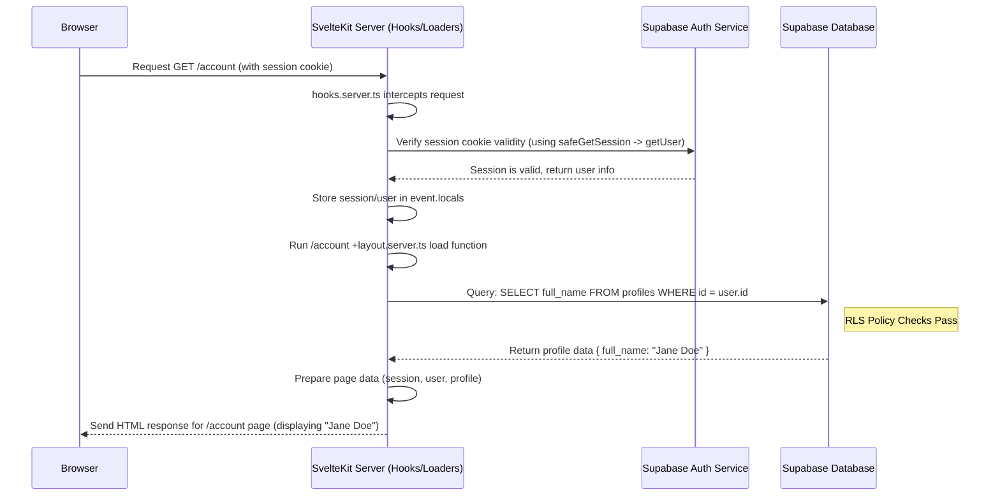

# Chapter 2: Supabase Integration (Auth & Database)

In [Chapter 1: SvelteKit Routing & Layouts](01_sveltekit_routing___layouts_.md), we learned how to structure the pages and shared UI of our application, like building the rooms and hallways of a house. But what about controlling who can enter which rooms and keeping track of information about the residents?

That's where **Supabase** comes in! It handles two crucial jobs for us:

1.  **Authentication (Auth):** Making sure users are who they say they are (signing up, logging in).
2.  **Database:** Storing and retrieving information, like user profiles or application data.

## What's the Big Idea?

Imagine our application is an apartment building.

- **Supabase Auth** is like the **security guard** at the entrance. They check IDs (usernames/passwords) when someone tries to enter (log in) or sign up for residency. They also handle things like lost keys (password resets).
- **Supabase Database** is like the building's **record keeper**. They have a file cabinet (database) with folders (tables) for each resident (user profiles) and other important information (like contact requests or subscription details).

`CMSaasStarter` uses Supabase so we don't have to build our own complex security system and record-keeping office from scratch.

**Use Case:** Let's say a new user wants to use our awesome SaaS app. They need to:

1.  **Sign up** for an account using their email and a password.
2.  **Log in** with those credentials.
3.  Once logged in, see their own **account page** where their name is displayed.

Supabase makes all of this possible and integrates neatly with our SvelteKit app.

## Key Concepts

### 1. Supabase: The Backend-as-a-Service (BaaS)

Supabase is an external service that provides common backend features needed by many applications. Instead of setting up our own servers, user management systems, and databases, we use Supabase's ready-made solutions. It's like hiring the security guard and record keeper instead of training our own.

`CMSaasStarter` connects to Supabase using special keys stored in your environment settings.

```bash
# .env.example (Simplified - DO NOT commit real keys!)
PUBLIC_SUPABASE_URL='https://YOUR_PROJECT_ID.supabase.co'
PUBLIC_SUPABASE_ANON_KEY='YOUR_ANON_KEY...' # Safe for browsers
PRIVATE_SUPABASE_SERVICE_ROLE='YOUR_SERVICE_KEY...' # Keep secret!
```

- `PUBLIC_SUPABASE_URL`: The address of your Supabase project.
- `PUBLIC_SUPABASE_ANON_KEY`: A "public" key used by the browser-side code. It has limited permissions defined by you in Supabase.
- `PRIVATE_SUPABASE_SERVICE_ROLE`: A "secret" key used only on the server. It has full admin access to your Supabase project. Never expose this key in browser code!

These keys tell our SvelteKit app how to find and securely communicate with _our specific_ Supabase project.

### 2. Supabase Auth: The Security Guard

This part handles everything related to users:

- **Signing Up:** Creating new user accounts (usually with email/password, but can also use Google, GitHub, etc.).
- **Logging In:** Verifying a user's credentials.
- **Password Resets:** Helping users who forgot their password.
- **Managing Sessions:** Keeping track of who is logged in as they navigate the app.

Supabase provides functions (like `supabase.auth.signUp(...)` and `supabase.auth.signInWithPassword(...)`) that our SvelteKit code calls to perform these actions.

### 3. Supabase Database: The Record Keeper

Supabase provides a powerful **PostgreSQL database**. We use it to store application data.

- **Tables:** Like spreadsheets or folders in the record keeper's cabinet. `CMSaasStarter` has tables like `profiles` (for user info), `stripe_customers` (for billing), and `contact_requests`.
- **Columns:** The specific pieces of information within a table, like `id`, `full_name`, `email` in the `profiles` table.
- **Rows:** Individual records, like the profile information for a specific user.

We define the structure of these tables using SQL (Structured Query Language).

```sql
-- database_migration.sql (Simplified 'profiles' table)
create table profiles (
  id uuid references auth.users on delete cascade not null primary key, -- Links to Supabase Auth user
  updated_at timestamp with time zone,
  full_name text,
  company_name text,
  avatar_url text,
  website text
);

-- Allow users to see and modify *only their own* profile
alter table profiles enable row level security; -- Turn on security

create policy "Profiles are viewable by self." on profiles
  for select using (auth.uid() = id); -- You can SELECT if your user ID matches the row's ID

create policy "Users can update own profile." on profiles
  for update using (auth.uid() = id); -- You can UPDATE if your user ID matches the row's ID
```

- This SQL code creates the `profiles` table.
- The `id` column connects this profile record to the user created by Supabase Auth.
- **Row Level Security (RLS)** is crucial. It's like telling the record keeper, "Only show residents their _own_ files." The policies ensure users can only access and modify their own data, even if they try to guess other user IDs.

### 4. Migrations: Tracking Database Changes

What if we need to add a new column (like `company_name`) to our `profiles` table later? We use **database migrations**.

Migrations are stored in the `supabase/migrations` folder. Each file contains SQL commands to update the database structure from one version to the next.

```
supabase/
└── migrations/
    ├── 20240730010101_initial.sql        <-- Creates initial tables
    └── 20240731051052_add_unsubscribed_to_profiles.sql <-- Adds a new column
```

This keeps our database schema organized and allows us to reliably update it as the application evolves.

### 5. Server Hooks & Helpers: The Communication Link

How does our SvelteKit app constantly check if the user is logged in (authenticated) before showing them private pages? Through **Server Hooks**.

- `src/hooks.server.ts`: This file contains code that runs on the server for _almost every request_ that comes into our application. Think of it as a checkpoint just inside the building's main door.
- **Supabase Client Initialization:** Inside the hook, we create connections (clients) to Supabase using the environment keys. One client uses the public `ANON_KEY` (for general use) and another uses the secret `SERVICE_ROLE` key (for admin tasks).
- **Session Checking:** The hook uses Supabase helper functions (`@supabase/ssr`) to securely read authentication information (usually stored in browser cookies) and verify with Supabase Auth if the user has a valid, active session.
- **`event.locals`:** If the user is logged in, the hook stores the user's session and profile information in a special object called `event.locals`. This object is then available to our page loading functions (`+layout.server.ts`, `+page.server.ts`).

```typescript
// src/hooks.server.ts (Highly Simplified)
import { createServerClient } from "@supabase/ssr"
import type { Handle } from "@sveltejs/kit"
import { sequence } from "@sveltejs/kit/hooks"

// Hook 1: Initialize Supabase connection for every request
export const supabase: Handle = async ({ event, resolve }) => {
  // Create a Supabase client using keys from .env
  event.locals.supabase =
    createServerClient(/* ... keys and cookie config ... */)

  // Helper function to safely get session and user data
  event.locals.safeGetSession = async () => {
    // 1. Get session from cookies/headers
    const {
      data: { session },
    } = await event.locals.supabase.auth.getSession()
    if (!session) return { session: null, user: null }

    // 2. *Verify* the session with Supabase Auth to be sure it's valid
    const {
      data: { user },
      error,
    } = await event.locals.supabase.auth.getUser()
    if (error) return { session: null, user: null } // Invalid session

    return { session, user } // Valid session!
  }

  // Continue processing the request
  return resolve(event)
}

// Hook 2: Use the helper to load session/user into locals
const authGuard: Handle = async ({ event, resolve }) => {
  const { session, user } = await event.locals.safeGetSession()
  event.locals.session = session // Store session for page loaders
  event.locals.user = user // Store user for page loaders

  return resolve(event)
}

// Run hooks in sequence
export const handle: Handle = sequence(supabase, authGuard)
```

This hook acts like our security guard checking the user's ID (session cookie) with the main office (Supabase Auth) every time they try to access a part of the building (make a request). If the ID is valid, the guard notes down who they are (`event.locals.user`) so other parts of the app know.

## Solving the Use Case: Sign Up, Log In, View Profile

Let's see how these concepts work together for our user:

1.  **Sign Up / Log In:**

    - The user visits a page like `/login` (handled by `(marketing)/login/+page.svelte`).
    - This page uses UI components (from `@supabase/auth-ui-svelte`, configured in `(marketing)/login/login_config.ts`) that call Supabase functions like `supabase.auth.signUp(...)` or `supabase.auth.signInWithPassword(...)` directly from the browser (using the `PUBLIC_SUPABASE_ANON_KEY`).
    - If successful, Supabase Auth sends a confirmation email (for signup) or sets a secure cookie in the user's browser to represent their logged-in session.
    - The user might be redirected via `(marketing)/auth/callback/+server.js` which handles exchanging a temporary code for the actual session cookie.

2.  **Navigating to Account Page (`/account`):**

    - The user clicks a link to `/account`.
    - The browser sends a request to the SvelteKit server for the `/account` page. The session cookie is automatically included.
    - **Hook Execution:** `src/hooks.server.ts` runs.
      - It initializes `event.locals.supabase`.
      - `event.locals.safeGetSession()` reads the cookie and verifies the session with Supabase Auth. It finds a valid session and user.
      - It stores the `session` and `user` objects in `event.locals`.
    - **Layout Load Function:** SvelteKit finds the `(admin)/account/+layout.server.ts` file (because `/account` is inside the `(admin)` group). Its `load` function runs _before_ the page is rendered.

    ```typescript
    // src/routes/(admin)/account/+layout.ts (Simplified Load Function)
    import { redirect } from "@sveltejs/kit"
    import type { LayoutServerLoad } from "./$types"

    export const load: LayoutServerLoad = async ({
      locals: { session, user, supabase },
      url,
    }) => {
      // The 'session' and 'user' come directly from the hook!
      if (!session || !user) {
        // If no valid session (hook found nothing), redirect to login
        redirect(303, "/login")
      }

      // Fetch the user's profile data from the 'profiles' table
      const { data: profile } = await supabase
        .from("profiles")
        .select(`full_name, company_name`) // Select specific columns
        .eq("id", user.id) // Match the logged-in user's ID
        .single() // Expect only one row

      // Make session, user, and profile data available to the page component
      return { session, user, profile }
    }
    ```

    - This `load` function first checks if `session` exists (thanks to the hook). If not, it redirects the user away from this private page.
    - If logged in, it uses `supabase.from("profiles").select(...)` to query the database. Notice how it uses `user.id` (provided by the hook) to fetch the correct profile. Row Level Security ensures this query _only_ works for the logged-in user's ID.
    - It returns the `session`, `user`, and `profile` data.

3.  **Displaying the Profile:**
    - The data returned by the `load` function is now available to the Svelte components for that layout (`(admin)/account/(menu)/+layout.svelte`) and the page (`(admin)/account/(menu)/+page.svelte`).
    - The Svelte code can simply access this data to display the user's name or other profile information.

## Under the Hood: Request Flow

Let's visualize the process when a logged-in user requests their `/account` page:



The key takeaway is that the server hooks (`hooks.server.ts`) act as a central checkpoint, validating the user's session with Supabase Auth on every relevant request and making the user's status available (`event.locals`) to the rest of the SvelteKit application, particularly the server `load` functions which then fetch data from the Supabase Database.

## Conclusion

You've now seen how `CMSaasStarter` integrates with Supabase to handle two fundamental aspects of a web application:

- **Authentication:** Securely managing user sign-ups, logins, and sessions using Supabase Auth (the "Security Guard").
- **Database:** Storing and retrieving application data like user profiles using Supabase's PostgreSQL database (the "Record Keeper"), protected by Row Level Security.
- **Integration:** SvelteKit Server Hooks (`hooks.server.ts`) and load functions (`+layout.server.ts`, `+page.server.ts`) work together to check authentication status on the server and fetch the necessary data for each page request.

With the backend for authentication and data storage in place, we can now focus on building the user interface for managing account settings.

Let's move on to [Chapter 3: Account Management UI](03_account_management_ui_.md) to see how users interact with their profile and settings.

---

Generated by [AI Codebase Knowledge Builder](https://github.com/The-Pocket/Tutorial-Codebase-Knowledge)
