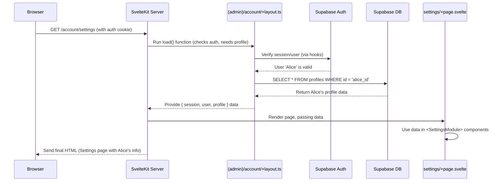

# Chapter 3: Account Management UI

In [Chapter 2: Supabase Integration (Auth & Database)](02_supabase_integration__auth___database__.md), we set up our application's security guard (Supabase Auth) and record keeper (Supabase Database). Now that users can securely log in, we need to give them a private space to manage their account details.

## What's the Big Idea?

Imagine our SaaS application is like a fancy apartment building. Logging in gets you past the front door security. But once inside, you need access to your own private apartment portal. This is where you can:

- Check the status of your lease (view account/subscription status).
- Update your contact information (update profile).
- Manage rent payments (manage billing).
- Change your apartment keys (change password).
- Submit a notice to move out (delete account).

The **Account Management UI** is this private portal within `CMSaasStarter`. It's the collection of pages accessible _only_ after a user has logged in, allowing them to manage their relationship with your service.

**Use Case:** A user, let's call her Alice, has logged into our application. She wants to update her company name in her profile. She needs to navigate to her account settings page, find the profile section, edit the company name, and save the changes.

## Key Concepts

### 1. The Private Area: The `(admin)` Route Group

Remember from [Chapter 1: SvelteKit Routing & Layouts](01_sveltekit_routing___layouts_.md) how we used parenthesis `()` folders to group routes without changing the URL? `CMSaasStarter` uses an `(admin)` group for all pages that require a user to be logged in.

```
src/
└── routes/
    ├── (admin)/           <-- Group for logged-in users (URL doesn't include /admin)
    │   ├── +layout.svelte   <-- Basic wrapper for admin area
    │   ├── +layout.ts       <-- SERVER code: CHECKS LOGIN STATUS! (From Ch 2)
    │   ├── account/         <-- All account-related pages live here (URL: /account/...)
    │   │   ├── (menu)/      <-- Sub-group for pages WITH the sidebar menu
    │   │   │   ├── +layout.svelte <-- The sidebar menu layout itself
    │   │   │   ├── +page.svelte   <-- Account Dashboard (URL: /account)
    │   │   │   ├── billing/
    │   │   │   │   └── +page.svelte <-- Billing Page (URL: /account/billing)
    │   │   │   └── settings/
    │   │   │       ├── +page.svelte <-- Settings Overview (URL: /account/settings)
    │   │   │       ├── edit_profile/+page.svelte <-- Edit Profile page
    │   │   │       └── ... (other settings pages: change email, password, delete)
    │   │   ├── create_profile/ <-- Special page *without* the sidebar
    │   │   │    └── +page.svelte
    │   │   └── sign_out/      <-- Action to sign out
    │   │        └── +page.server.ts
    │   └── ... (maybe other admin sections later)
    │
    ├── (marketing)/       <-- Public pages group (from Ch 1)
    └── ...
```

- Any route inside `src/routes/(admin)/` automatically uses the logic in `src/routes/(admin)/+layout.ts`.
- As we saw in Chapter 2, this `+layout.ts` file is crucial. It runs on the server for every request to a page within `(admin)/` and checks if the user has a valid session using `event.locals.safeGetSession()`. If not, it redirects them to the login page. This acts like a security checkpoint for the entire "residents only" floor.

```typescript
// src/routes/(admin)/account/+layout.ts (Simplified Recap)
import { redirect } from "@sveltejs/kit"
import type { LayoutLoad } from "./$types"
// ... other imports

// This load function runs on the SERVER before rendering any page inside (admin)/account/
export const load: LayoutLoad = async ({ data, depends, url }) => {
  // Ensure Supabase auth state is fresh
  depends("supabase:auth")

  // Get session/user info (provided by hooks.server.ts from Chapter 2)
  const { session, user } = await load_helper(data.session, data.supabase)

  // *** THE GUARD ***
  // If no valid session, kick user out to login page
  if (!session || !user) {
    redirect(303, "/login")
  }

  // Fetch the user's profile data from Supabase DB (from Chapter 2)
  const { data: profile } = await data.supabase
    .from("profiles")
    .select(`*`)
    .eq("id", user.id)
    .single()

  // Check if profile is complete (if required) and redirect if not
  // ... (code for create_profile redirect)

  // Make session, user, and profile available to Svelte components
  return { session, profile, user, supabase: data.supabase }
}
```

This file ensures only logged-in users can access `/account/*` pages and also fetches their profile data needed for display.

### 2. The Sidebar Layout: The `(menu)` Group

Most pages within the account section share a common structure: a navigation sidebar on the left and the main content area on the right. To achieve this consistently, `CMSaasStarter` uses _another_ layout group nested inside `(admin)/account/`: the `(menu)` group.

- `src/routes/(admin)/account/(menu)/+layout.svelte`: This file defines the HTML and Svelte code for the drawer/sidebar layout.

```svelte
<!-- src/routes/(admin)/account/(menu)/+layout.svelte (Simplified) -->
<script lang="ts">
  // Imports for styles, etc.
  import "../../../../app.css";
  interface Props { children?: import("svelte").Snippet; }
  let { children }: Props = $props();
  // ... logic to handle drawer open/close ...
</script>

<div class="drawer lg:drawer-open"> {/* DaisyUI component for sidebar */}
  <input id="admin-drawer" type="checkbox" class="drawer-toggle" />

  <!-- Page Content Area -->
  <div class="drawer-content p-6">
    <!-- Header for mobile (hamburger menu) -->
    <div class="navbar bg-base-100 lg:hidden">
       {/* ... mobile header ... */}
    </div>
    <!-- *** Actual page content (+page.svelte) goes here! *** -->
    {@render children?.()}
  </div>

  <!-- Sidebar Menu -->
  <div class="drawer-side">
    <label for="admin-drawer" class="drawer-overlay"></label>
    <ul class="menu p-4 w-80 min-h-full bg-base-100 text-primary">
      <li><a href="/account">Home</a></li>
      <li><a href="/account/billing">Billing</a></li>
      <li><a href="/account/settings">Settings</a></li>
      <li class="mt-auto"><a href="/account/sign_out">Sign Out</a></li>
    </ul>
  </div>
</div>
```

This layout provides the consistent navigation structure (the sidebar) for pages like the dashboard, billing, and settings. The specific content for each page (like `/account/settings/+page.svelte`) is injected where `{@render children?.()}` is placed.

### 3. Specific Account Pages (`+page.svelte`)

Inside the `(admin)/account/(menu)/` folder (and its subfolders like `settings/`), individual `+page.svelte` files define the unique content for each section:

- `src/routes/(admin)/account/(menu)/+page.svelte`: The main dashboard content (currently a placeholder in `CMSaasStarter`).
- `src/routes/(admin)/account/(menu)/billing/+page.svelte`: Shows current subscription status or options to select a plan. It uses data loaded from the server about the user's Stripe status (more in [Chapter 4: Stripe Billing & Subscriptions](04_stripe_billing___subscriptions_.md)).
- `src/routes/(admin)/account/(menu)/settings/+page.svelte`: An overview page linking to different setting areas (Profile, Email, Password, etc.). It often displays read-only information fetched earlier (like the user's email and profile name).
- `src/routes/(admin)/account/(menu)/settings/edit_profile/+page.svelte`: A form allowing the user to update their profile information (name, company, website).
- Other `settings/.../+page.svelte` files handle changing email, password, and deleting the account, usually presenting a form for the user to interact with.

### 4. Reusable UI: The `SettingsModule` Component

You'll notice many settings pages look similar: a title, some fields (sometimes editable, sometimes read-only), and a button to save or navigate. To avoid repeating code, `CMSaasStarter` uses a reusable Svelte component: `SettingsModule.svelte`.

```svelte
<!-- src/routes/(admin)/account/(menu)/settings/settings_module.svelte (Simplified Structure) -->
<script lang="ts">
  // Props to customize the module (title, fields, editable, etc.)
  interface Props { /* ... title, fields, editable, dangerous, formTarget ... */ }
  let { /* ... props ... */ }: Props = $props();
  // ... internal state for loading, success ...
  // ... handleSubmit function using SvelteKit's 'enhance' ...
</script>

<div class="card p-6 mt-8 max-w-xl shadow-sm">
  {#if title}
    <div class="text-xl font-bold mb-3">{title}</div>
  {/if}

  <div class="w-full">
    {#if !showSuccess}
      <form method="POST" action={formTarget} use:enhance={handleSubmit}>
        {#each fields as field}
          <!-- Display label -->
          {#if field.label} <label for={field.id}>{field.label}</label> {/if}
          <!-- Display input or read-only text based on 'editable' prop -->
          {#if editable}
            <input id={field.id} name={field.id} type="text" value={...} />
          {:else}
            <div>{field.initialValue}</div>
          {/if}
        {/each}

        <!-- Display error messages if any -->
        {#if $page?.form?.errorMessage} <p>{$page.form.errorMessage}</p> {/if}

        <!-- Display Save button or Edit link -->
        {#if editable}
          <button type="submit" disabled={loading}>Save</button>
        {:else if editButtonTitle && editLink}
          <a href={editLink}><button>{editButtonTitle}</button></a>
        {/if}
      </form>
    {:else}
      <!-- Show success message -->
      <div>Success!</div>
    {/if}
  </div>
</div>
```

Pages like `/account/settings/+page.svelte` simply use this component multiple times, configuring it for each section (Profile, Email, Password).

```svelte
<!-- src/routes/(admin)/account/(menu)/settings/+page.svelte (Simplified) -->
<script lang="ts">
  import SettingsModule from "./settings_module.svelte"
  let { data } = $props() // Data (user, profile) loaded by layout.ts
</script>

<h1 class="text-2xl font-bold mb-6">Settings</h1>

<!-- Profile Section (Read-only, links to edit page) -->
<SettingsModule
  title="Profile"
  editable={false}
  fields={[
    { label: "Name", initialValue: data.profile?.full_name ?? "" },
    { label: "Company Name", initialValue: data.profile?.company_name ?? "" },
    /* ... */
  ]}
  editButtonTitle="Edit Profile"
  editLink="/account/settings/edit_profile"
/>

<!-- Email Section (Read-only, links to change email page) -->
<SettingsModule
  title="Email"
  editable={false}
  fields={[{ initialValue: data.user?.email || "" }]}
  editButtonTitle="Change Email"
  editLink="/account/settings/change_email"
/>

<!-- More SettingsModule instances for Password, Danger Zone, etc. -->
```

This makes the code for settings pages very clean and consistent.

### 5. Handling Actions (Forms & Server Actions)

When Alice submits the "Edit Profile" form, how does the data get saved?

- The `<form>` uses SvelteKit's `use:enhance` directive. This progressively enhances the standard HTML form submission.
- The `action` attribute of the form points to a server-side function, often defined in a `+page.server.ts` or, in `CMSaasStarter`, often centralized in `/routes/account/api/+server.ts` using named actions (e.g., `action="/account/api?/updateProfile"`).
- This server-side action receives the form data, validates it, and interacts with Supabase (using the server client) to update the `profiles` table in the database.
- We'll dive deeper into how these server actions and API endpoints work in [Chapter 6: Server Hooks & API Endpoints](06_server_hooks___api_endpoints_.md).

## Solving the Use Case: Alice Updates Her Profile

1.  **Login:** Alice logs in (handled by Supabase Auth, Chapter 2).
2.  **Navigate to Settings:** She clicks a link to `/account/settings`.
3.  **Auth Check & Data Load:**
    - SvelteKit routing directs the request to the `(admin)` group.
    - `src/routes/(admin)/account/+layout.ts` runs, verifies her session with Supabase, and fetches her profile data (`{ full_name: 'Alice', company_name: 'Old Company' }`).
4.  **Render Settings Overview:**
    - The `(admin)/account/(menu)/+layout.svelte` renders the sidebar.
    - `src/routes/(admin)/account/(menu)/settings/+page.svelte` renders, using `SettingsModule` to display her current profile info (read-only).
5.  **Navigate to Edit Profile:** Alice clicks the "Edit Profile" button associated with the Profile `SettingsModule`. This navigates her to `/account/settings/edit_profile`.
6.  **Render Edit Form:**
    - The auth check and data load happen again (or use cached data).
    - `src/routes/(admin)/account/(menu)/settings/edit_profile/+page.svelte` renders, using `SettingsModule` again, but this time configured as `editable={true}`. It pre-fills the form fields with her current profile data.
7.  **Submit Changes:** Alice changes the Company Name field to "New Company Inc." and clicks "Save".
8.  **Form Submission:**
    - `use:enhance` intercepts the form submission.
    - It sends a POST request to the specified server action (`/account/api?/updateProfile`).
9.  **Server Action Processing:**
    - The `updateProfile` action function runs on the server.
    - It receives `{ fullName: 'Alice', companyName: 'New Company Inc.', website: '...' }`.
    - It uses the server Supabase client to `update` the `profiles` table where `id` matches Alice's user ID.
    - It returns a success or error message back to the browser.
10. **UI Update:** `use:enhance` updates the page, potentially showing a success message within the `SettingsModule`. Alice's profile is now updated in the database.

## Under the Hood: Rendering the Settings Page

Let's trace the key steps when Alice requests the `/account/settings` page after logging in:



The process ensures that:
a) Only authenticated users reach the page (`LayoutTS` check).
b) The necessary data (profile) is fetched _before_ rendering (`LayoutTS` fetch).
c) The page component (`PageSvelte`) receives this data and displays it.

## Conclusion

You've now explored the user's private dashboard – the Account Management UI.

- It resides within the `src/routes/(admin)/account/` structure, protected by authentication checks in the `(admin)/+layout.ts` file.
- Nested layouts like `(menu)/+layout.svelte` provide consistent UI elements like sidebars.
- Individual `+page.svelte` files define the content for specific sections (Dashboard, Billing, Settings).
- Reusable components like `SettingsModule.svelte` help build consistent settings forms efficiently.
- User actions (like updating a profile) are typically handled by forms submitting data to server actions (more in Chapter 6).

This area is the user's command center for interacting with their account. One of the most crucial parts of any SaaS is managing payments and subscriptions.

Let's move on to [Chapter 4: Stripe Billing & Subscriptions](04_stripe_billing___subscriptions_.md) to see how `CMSaasStarter` integrates with Stripe to handle exactly that.

---

Generated by [AI Codebase Knowledge Builder](https://github.com/The-Pocket/Tutorial-Codebase-Knowledge)
