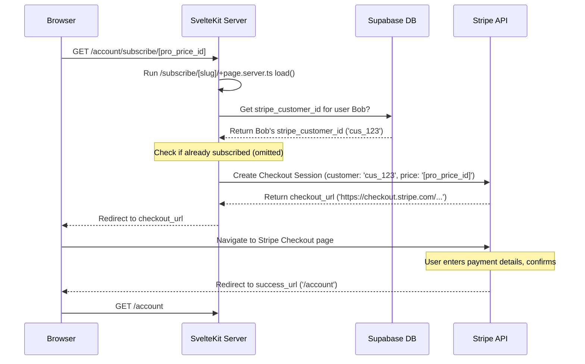
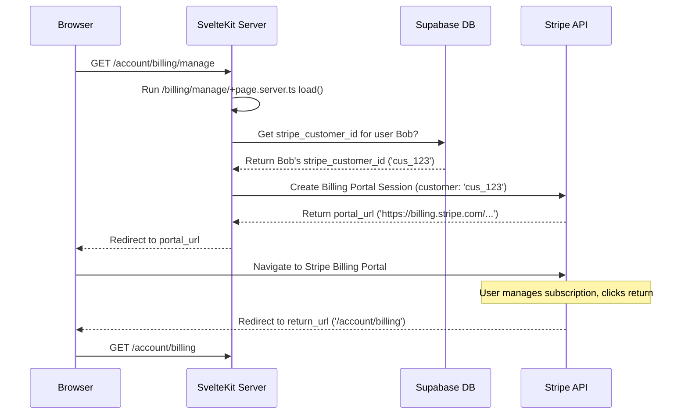

# Chapter 4: Stripe Billing & Subscriptions

Welcome to Chapter 4! In [Chapter 3: Account Management UI](03_account_management_ui_.md), we built the private area where users can manage their profile settings. But for many Software as a Service (SaaS) apps, a key part is handling payments and different subscription levels. How do users pay for premium features? How do they manage their payment details or cancel their plan?

## What's the Big Idea?

Handling money online securely is complex. We need a reliable way to:

1.  Show different subscription plans (e.g., Free, Pro, Enterprise).
2.  Let users securely enter payment details and start a subscription.
3.  Charge users automatically (e.g., monthly or yearly).
4.  Allow users to update their payment methods, view invoices, or cancel their subscriptions.

Instead of building this complicated payment system ourselves, `CMSaasStarter` uses **Stripe**, a popular and trusted third-party service specifically designed for online payments and subscriptions.

**Analogy: The Building's Rental Office**

Think of Stripe integration as the rental office for our application (the apartment building):

- **Pricing Page:** The brochure showing available apartments (plans) and their rent (price).
- **Stripe Checkout:** The process of signing the lease agreement, where the tenant provides their details and payment information securely.
- **Stripe Payments:** The automatic collection of monthly rent.
- **Stripe Billing Portal:** A self-service counter where tenants can review their lease, update payment methods, or give notice if they plan to move out (cancel).

`CMSaasStarter` connects to Stripe to handle all these "rental office" tasks.

**Use Case:** A user, let's call him Bob, is currently on the Free plan. He decides he needs the features of the "Pro" plan. He needs to be able to:

1.  See the Pro plan's price and features.
2.  Click a button to subscribe to the Pro plan.
3.  Securely enter his credit card information.
4.  Confirm the subscription.
5.  Later, view his current subscription status and maybe update his credit card.

`CMSaasStarter` uses Stripe to make this entire process smooth and secure for Bob.

## Key Concepts

### 1. Stripe: The Payment Processor

Stripe is the external company that handles the actual money movement, credit card details, and subscription logic. We never store sensitive credit card numbers directly in our application or database. Stripe handles all the security and compliance. We just tell Stripe _what_ to charge and _who_ to charge.

`CMSaasStarter` talks to Stripe using a secret API key stored securely on our server (never in the browser code!).

```bash
# .env.example (Reminder)
# ... other keys
PRIVATE_STRIPE_API_KEY='sk_test_...' # Your secret Stripe key (Keep safe!)
```

### 2. Stripe Products & Prices: The Plans

Inside our Stripe account (which you set up separately), we define the different subscription plans we offer. Each plan is a **Product** (e.g., "Pro Plan"), and each product can have one or more **Prices** (e.g., "$5 per month", "$50 per year").

In `CMSaasStarter`, we keep a local copy of this information to display on our pricing page.

```typescript
// src/routes/(marketing)/pricing/pricing_plans.ts (Simplified)
export const pricingPlans = [
  {
    id: "free", // Our internal ID
    name: "Free",
    // ... description, features ...
    stripe_price_id: null, // No Stripe price for free plan
    stripe_product_id: null,
  },
  {
    id: "pro",
    name: "Pro",
    // ... description, features ...
    price: "$5",
    stripe_price_id: "price_1Nkd...", // The ID from Stripe for the monthly price
    stripe_product_id: "prod_OXj...", // The ID from Stripe for the Pro product
  },
  // ... other plans ...
]
```

This file links our app's plan definitions to the actual Products and Prices set up in Stripe via their unique IDs (`stripe_price_id`, `stripe_product_id`).

### 3. Stripe Customers: Tracking Who Pays

When a user decides to subscribe, we need to tell Stripe who they are. Stripe creates a **Customer** object to represent each paying user in their system.

Crucially, we need to link our application's user (from Supabase Auth, see [Chapter 2: Supabase Integration (Auth & Database)](02_supabase_integration__auth___database__.md)) to their corresponding Stripe Customer ID. `CMSaasStarter` does this using a helper function on the server and stores the mapping in the Supabase database.

- **`stripe_customers` table (in Supabase):** Stores `user_id` (from our app) and `stripe_customer_id` (from Stripe).
- **`getOrCreateCustomerId` (Server Helper):** A function in `src/routes/(admin)/account/subscription_helpers.server.ts` that:
  1.  Checks if we already have a Stripe Customer ID for the logged-in user in our `stripe_customers` table.
  2.  If yes, returns it.
  3.  If no, tells Stripe to create a _new_ Customer (using the user's email), gets the new Stripe Customer ID back from Stripe, saves it in our `stripe_customers` table, and then returns it.

This function ensures each user in our app has a unique corresponding customer record in Stripe.

```typescript
// src/routes/(admin)/account/subscription_helpers.server.ts (Simplified getOrCreateCustomerId)
import type { SupabaseClient, User } from "@supabase/supabase-js"
import Stripe from "stripe"
// ... stripe initialization ...

export const getOrCreateCustomerId = async ({
  supabaseServiceRole,
  user,
}: {
  /*...*/
}) => {
  // 1. Look for existing customer ID in our database
  const { data: dbCustomer } = await supabaseServiceRole
    .from("stripe_customers")
    .select("stripe_customer_id")
    .eq("user_id", user.id) // Match our app's user ID
    .single()

  if (dbCustomer?.stripe_customer_id) {
    return { customerId: dbCustomer.stripe_customer_id } // Found it!
  }

  // 2. Not found? Create a new customer in Stripe
  const customer = await stripe.customers.create({
    email: user.email, // Use user's email
    metadata: { user_id: user.id /* ... other info ... */ },
  })

  // 3. Save the new Stripe customer ID in our database
  await supabaseServiceRole.from("stripe_customers").insert({
    user_id: user.id,
    stripe_customer_id: customer.id, // The ID from Stripe
  })

  return { customerId: customer.id } // Return the new ID
}
```

This logic runs securely on the server, using the Supabase service role client (see Chapter 2) and the Stripe secret key.

### 4. Stripe Checkout: The Secure Payment Page

When Bob clicks "Subscribe" for the Pro plan, we don't build our own credit card form. Instead, we use **Stripe Checkout**.

Our server tells Stripe: "Create a checkout session for Stripe Customer [Bob's Stripe ID] to subscribe to Price [Pro Plan's Stripe Price ID]. When they finish, send them back to `our-app.com/account`."

Stripe gives us back a unique, temporary URL for this checkout session. We then redirect Bob's browser to that URL.

```typescript
// src/routes/(admin)/account/subscribe/[slug]/+page.server.ts (Simplified Load Function)
// ... imports, stripe initialization ...

export const load: PageServerLoad = async ({ params, url, locals }) => {
  const { session, user } = await locals.safeGetSession()
  if (!session) redirect(303, "/login") // User must be logged in

  // Get the Stripe Price ID from the URL (e.g., 'price_1Nkd...')
  const stripePriceId = params.slug

  // Get or create the user's Stripe Customer ID (using helper from above)
  const { customerId } = await getOrCreateCustomerId({
    /* ... */
  })

  // Prevent subscribing if already subscribed (using another helper)
  // ... check existing subscription ...

  let checkoutUrl
  try {
    // Ask Stripe to create a secure Checkout Session
    const stripeSession = await stripe.checkout.sessions.create({
      customer: customerId, // Link to the Stripe Customer
      line_items: [{ price: stripePriceId, quantity: 1 }], // The plan they chose
      mode: "subscription", // We want a recurring subscription
      success_url: `${url.origin}/account`, // Where to send after success
      cancel_url: `${url.origin}/account/billing`, // Where to send if cancelled
    })
    checkoutUrl = stripeSession.url // Stripe gives us the URL
  } catch (e) {
    /* ... error handling ... */
  }

  // Redirect the user's browser to Stripe's secure page
  redirect(303, checkoutUrl ?? "/pricing")
}
```

Bob is now on a page hosted by Stripe. He enters his card details directly onto Stripe's secure servers. Our application never sees or touches the card number.

### 5. Stripe Billing Portal: Managing the Subscription

After Bob subscribes, what if his credit card expires, or he wants to cancel? We use the **Stripe Billing Portal**.

Similar to Checkout, our server asks Stripe: "Create a Billing Portal session for Stripe Customer [Bob's Stripe ID]. When they're done, send them back to `our-app.com/account/billing`."

Stripe gives us another unique, temporary URL. We redirect Bob to that URL.

```typescript
// src/routes/(admin)/account/(menu)/billing/manage/+page.server.ts (Simplified Load Function)
// ... imports, stripe initialization ...

export const load: PageServerLoad = async ({ url, locals }) => {
  const { session, user } = await locals.safeGetSession()
  if (!session) redirect(303, "/login") // User must be logged in

  // Get the user's Stripe Customer ID (using helper)
  const { customerId } = await getOrCreateCustomerId({
    /* ... */
  })

  let portalLink
  try {
    // Ask Stripe to create a secure Billing Portal Session
    const portalSession = await stripe.billingPortal.sessions.create({
      customer: customerId, // For this Stripe Customer
      return_url: `${url.origin}/account/billing`, // Where to send when done
    })
    portalLink = portalSession?.url // Stripe gives us the URL
  } catch (e) {
    /* ... error handling ... */
  }

  // Redirect the user's browser to Stripe's self-service portal
  redirect(303, portalLink ?? "/account/billing")
}
```

Bob is now on a secure page hosted by Stripe where he can manage his subscription (update card, view invoices, cancel plan) without us needing to build that complex UI.

### 6. Server-Side Helpers: Secure Communication

Notice that creating Checkout and Portal sessions _always_ happens in `.server.ts` files. This is crucial because these actions require our `PRIVATE_STRIPE_API_KEY`. We **must never** expose this key in the browser (JavaScript) code. All sensitive communication with Stripe happens securely from our SvelteKit server. The file `src/routes/(admin)/account/subscription_helpers.server.ts` contains reusable functions for these server-side Stripe interactions (like `getOrCreateCustomerId` and `fetchSubscription`).

### 7. Client-Side Pages: The User Interface

Users interact with billing through these pages:

- `/pricing` ([Chapter 1: SvelteKit Routing & Layouts](01_sveltekit_routing___layouts_.md)): Shows plans from `pricing_plans.ts`. Buttons link to `/account/subscribe/[stripe_price_id]`. (File: `src/routes/(marketing)/pricing/pricing_module.svelte`)
- `/account/billing` ([Chapter 3: Account Management UI](03_account_management_ui_.md)): Shows the user's _current_ subscription status (or prompts them to select a plan if they have none). It gets this status by calling `fetchSubscription` in its `+page.server.ts` file. Has a "Manage Subscription" button linking to `/account/billing/manage`. (File: `src/routes/(admin)/account/(menu)/billing/+page.svelte`)

## Solving the Use Case: Bob Subscribes and Manages

Let's walk through Bob's journey:

1.  **View Plans:** Bob goes to `/pricing`. He sees the Free and Pro plans displayed using the data from `pricing_plans.ts`.
2.  **Select Pro Plan:** He clicks the "Select Plan" (or similar) button under the Pro plan. This button is an `<a>` link pointing to `/account/subscribe/price_1Nkd...` (the Pro plan's Stripe Price ID).
3.  **Initiate Checkout (Server):**
    - His browser requests `/account/subscribe/price_1Nkd...`.
    - The `load` function in `src/routes/(admin)/account/subscribe/[slug]/+page.server.ts` runs on the server.
    - It checks if Bob is logged in.
    - It calls `getOrCreateCustomerId` to get Bob's `customerId` (let's say `cus_123`).
    - It checks if Bob is already subscribed (he isn't).
    - It calls `stripe.checkout.sessions.create(...)` with `customerId: 'cus_123'` and `price: 'price_1Nkd...'`.
    - Stripe returns a unique checkout URL like `https://checkout.stripe.com/pay/cs_test_a1B2...`.
    - The server sends a redirect instruction to Bob's browser.
4.  **Stripe Checkout:** Bob's browser automatically goes to the Stripe Checkout URL. He sees the Pro plan details and enters his credit card info directly on Stripe's secure page. He clicks "Subscribe".
5.  **Redirect Back:** Stripe processes the payment, creates the subscription, and redirects Bob's browser back to the `success_url` we specified: `/account`.
6.  **View Billing:** Bob navigates to `/account/billing`.
    - The `load` function in `src/routes/(admin)/account/(menu)/billing/+page.server.ts` runs.
    - It gets Bob's `customerId` (`cus_123`).
    - It calls `fetchSubscription({ customerId: 'cus_123' })`. This helper asks Stripe for active subscriptions for `cus_123`. Stripe confirms Bob has an active Pro plan subscription.
    - The `load` function returns data indicating Bob is active and on the 'pro' plan.
    - The `src/routes/(admin)/account/(menu)/billing/+page.svelte` page renders, showing "Current Plan: Pro" and a "Manage Subscription" button.
7.  **Manage Subscription:** Later, Bob wants to update his card. He goes to `/account/billing` and clicks "Manage Subscription". This links to `/account/billing/manage`.
8.  **Initiate Portal (Server):**
    - His browser requests `/account/billing/manage`.
    - The `load` function in `src/routes/(admin)/account/(menu)/billing/manage/+page.server.ts` runs.
    - It gets Bob's `customerId` (`cus_123`).
    - It calls `stripe.billingPortal.sessions.create(...)` for `cus_123`.
    - Stripe returns a unique portal URL like `https://billing.stripe.com/p/session/bpi_test_a1C3...`.
    - The server redirects Bob's browser to this URL.
9.  **Stripe Portal:** Bob is now on Stripe's secure portal. He updates his card details and clicks the button to return to the application.
10. **Redirect Back:** Stripe redirects Bob back to the `return_url` we specified: `/account/billing`.

## Under the Hood: The Flow

Let's visualize the main interactions when Bob subscribes:



And here's the flow for accessing the Billing Portal:



These flows highlight how our SvelteKit server acts as a secure intermediary, talking to Supabase to identify the user and to Stripe (using the secret key) to create the necessary sessions, before redirecting the user's browser to Stripe's hosted pages (Checkout or Portal).

## Conclusion

You've now learned how `CMSaasStarter` integrates with Stripe to handle the essential financial aspects of a SaaS application:

- **Stripe** acts as the secure payment processor and subscription manager (the "Rental Office").
- **Products & Prices** defined in Stripe are mirrored in `pricing_plans.ts` for display.
- **Stripe Customers** are created and linked to Supabase users via the `stripe_customers` table and the `getOrCreateCustomerId` helper.
- **Stripe Checkout** provides a secure, hosted page for users to start subscriptions.
- **Stripe Billing Portal** provides a secure, hosted page for users to manage their existing subscriptions.
- All sensitive interactions with Stripe happen on the **server-side** (`.server.ts` files) using secure API keys.
- **Client-side pages** (`/pricing`, `/account/billing`) provide the user interface to view plans and access billing management.

With users able to sign up, manage their accounts, and handle billing, our core SaaS structure is taking shape. But most applications also need to display content – like blog posts, documentation, or marketing pages.

Let's move on to [Chapter 5: Static Content & Search](05_static_content___search_.md) to see how `CMSaasStarter` manages and displays static content like blog posts.

---

Generated by [AI Codebase Knowledge Builder](https://github.com/The-Pocket/Tutorial-Codebase-Knowledge)
