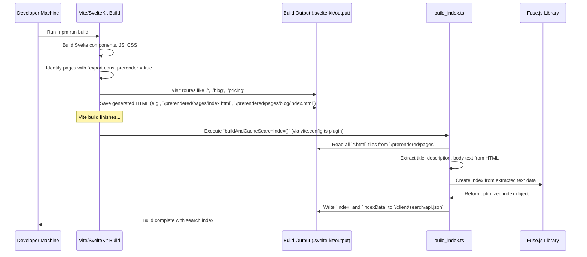
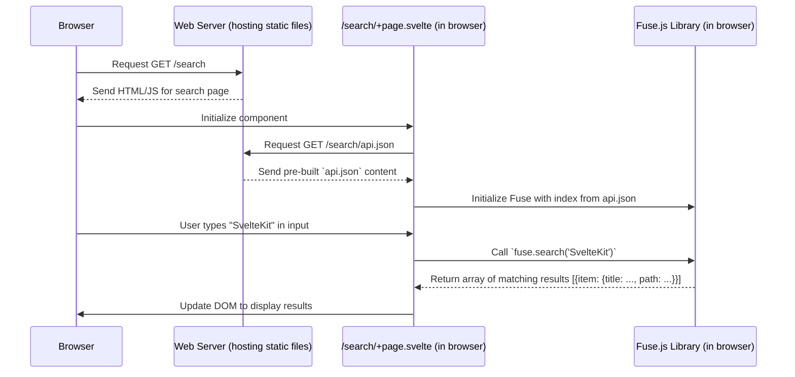

# Chapter 5: Static Content & Search

In [Chapter 4: Stripe Billing & Subscriptions](04_stripe_billing___subscriptions_.md), we set up the "rental office" for our application, allowing users to subscribe and manage payments using Stripe. Now, let's shift focus to the parts of our application that _everyone_ can see – the public-facing content like the homepage, pricing page, and blog. We also want a way for users to quickly search this content.

## What's the Big Idea?

Imagine our SaaS application (the apartment building) needs a public lobby, some informational posters (like pricing), and maybe a community bulletin board (the blog). We want this information to be:

1.  **Instantly Available:** Visitors shouldn't wait for the information desk to prepare a brochure; it should be ready immediately.
2.  **Fast to Access:** Reading a poster should be quick.
3.  **Searchable:** Visitors should be able to quickly find information on the bulletin board without reading every single notice.

This is where **Static Content & Search** comes in.

- **Static Content:** These are the parts of your website (homepage, `/pricing`, `/blog`) that don't change based on the logged-in user. SvelteKit can **pre-render** these pages into simple HTML files during the build process, making them super fast to load for visitors.
- **Search:** Instead of setting up a complex, expensive search server, we create a **search index** (like a detailed table of contents) when we build the site. This index is then used directly in the visitor's browser for lightning-fast searching of the static content.

**Analogy: The Building Lobby & Directory**

- **Static Pages (Homepage, Blog):** Think of these as the building's lobby, posters, and public bulletin board displays. They are always ready, look the same for everyone, and are very quick to view because they're pre-prepared.
- **Search Index:** This is like an indexed directory board in the lobby. It lists all the public information (offices, notices) and where to find them.
- **Client-Side Search:** When you use the directory board, you're looking things up right there (in your browser) using the index, without needing to ask the building staff (a backend server).

**Use Case:** A visitor lands on our homepage. They navigate to the blog, read a post, and then want to find all posts mentioning "SvelteKit". They use the search bar, type "SvelteKit", and instantly see a list of relevant blog posts.

## Key Concepts

### 1. Static Content & Prerendering

Pages that don't require user-specific data or frequent updates are great candidates for being static. In SvelteKit, we can tell the build process to pre-render a page into a plain HTML file.

- **How?** By adding `export const prerender = true;` to a page's server-side script (`+page.ts` or `+layout.ts`).
- **Where?** `CMSaasStarter` prerenders public pages like the homepage (`src/routes/(marketing)/+page.ts`), the pricing page (`src/routes/(marketing)/pricing/+page.ts`), and the entire blog section (`src/routes/(marketing)/blog/+layout.ts`).

```typescript
// src/routes/(marketing)/pricing/+page.ts
// This simple line tells SvelteKit to turn this page into static HTML during build
export const prerender = true
```

When you run `npm run build`, SvelteKit "visits" these pages, runs any necessary code to generate the content, and saves the final HTML output. When a user visits `/pricing`, the web server can send this pre-built HTML file directly, which is incredibly fast.

### 2. Blog System: Simple File-Based Content

The blog in `CMSaasStarter` doesn't need a complex database for its public posts.

- **Post Definitions:** Information about each blog post (title, description, date, URL slug) is stored in a simple TypeScript array in `src/routes/(marketing)/blog/posts.ts`.

```typescript
// src/routes/(marketing)/blog/posts.ts (Simplified)
export const blogInfo = { name: "SaaS Starter Blog" };

export type BlogPost = {
  link: string; // e.g., '/blog/example_blog_post'
  date: string; // e.g., '2023-03-13'
  title: string;
  description: string;
  parsedDate?: Date;
};

// The list of all blog posts
const blogPosts: BlogPost[] = [
  {
    title: "Example Blog Post",
    description: "A sample blog post",
    link: "/blog/example_blog_post",
    date: "2023-03-13",
  },
  // ... more posts
];

// ... code to sort posts by date ...
export const sortedBlogPosts = /* sorted list */;
```

This makes adding or updating post metadata very straightforward.

- **Post Content:** The actual content of each blog post lives inside a corresponding Svelte component within the `src/routes/(marketing)/blog/(posts)/` directory. For example, the content for `/blog/example_blog_post` is in `src/routes/(marketing)/blog/(posts)/example_blog_post/+page.svelte`.

```svelte
<!-- src/routes/(marketing)/blog/(posts)/example_blog_post/+page.svelte -->
<p class="lead">This is the main content of the blog post.</p>

<p>You can use standard HTML and Svelte features here.</p>

<blockquote>Blockquotes look like this.</blockquote>

<pre><code class="language-javascript">
// Code blocks are supported too
console.log('Hello, Blog!');
</code></pre>
```

The structure uses SvelteKit's file-based routing ([Chapter 1: SvelteKit Routing & Layouts](01_sveltekit_routing___layouts_.md)). The `(posts)` layout (`src/routes/(marketing)/blog/(posts)/+layout.svelte`) handles wrapping each post with common elements like the title and date, and ensures these pages are also pre-rendered.

### 3. Build-Time Search Indexing

How can we search this static content without a backend? By preparing everything in advance!

- **Vite Plugin:** `CMSaasStarter` uses a custom Vite plugin defined in `vite.config.ts`. This plugin hooks into the _end_ of the build process (`npm run build`).

```typescript
// vite.config.ts (Simplified Plugin Definition)
import { sveltekit } from "@sveltejs/kit/vite"
import { defineConfig } from "vitest/config"
import { buildAndCacheSearchIndex } from "./src/lib/build_index" // Our custom function

export default defineConfig({
  plugins: [
    sveltekit(),
    {
      // Custom plugin to build the search index
      name: "vite-build-search-index",
      writeBundle: {
        // Run *after* SvelteKit finishes building files
        order: "post",
        handler: async () => {
          console.log("Building search index...")
          await buildAndCacheSearchIndex() // Call our index builder
        },
      },
    },
  ],
  // ... test config ...
})
```

This tells Vite: "After you finish building the site, run the `buildAndCacheSearchIndex` function."

- **Index Builder (`build_index.ts`):** This Node.js script (`src/lib/build_index.ts`) does the "librarian" work:
  1.  Finds all the pre-rendered HTML files SvelteKit just created (in `.svelte-kit/output/prerendered/pages`).
  2.  Reads each HTML file.
  3.  Extracts the main text content, title, and description.
  4.  Uses a library called **Fuse.js** to build a optimized search index from this extracted data.
  5.  Saves the index and the raw data into a single JSON file: `.svelte-kit/output/client/search/api.json`.

This `api.json` file contains everything needed to perform searches later.

### 4. Client-Side Search with Fuse.js

Now that we have the pre-built index file (`search/api.json`), the actual search happens entirely in the user's browser.

- **Search Page (`/search`):** The page at `src/routes/(marketing)/search/+page.svelte` is responsible for the search UI.
- **Fetching the Index:** When the user visits `/search`, the Svelte component fetches the `/search/api.json` file created during the build.
- **Initializing Fuse.js:** It uses the data from `api.json` to initialize Fuse.js in the browser.
- **Performing Search:** As the user types into the search input box, the Svelte component calls `fuse.search('user query')`. Fuse.js uses its optimized index to find matching pages _instantly_, without any network requests to a backend server.
- **Displaying Results:** The component updates the UI to show the list of matching pages found by Fuse.js.

```svelte
<!-- src/routes/(marketing)/search/+page.svelte (Simplified Logic) -->
<script lang="ts">
  import Fuse from "fuse.js"
  import { onMount } from "svelte"

  // State variables
  let fuse = $state<Fuse<Result>>() // Fuse.js instance
  let indexData = $state<Result[]>([]) // Raw data for display
  let results = $state<Result[]>([]) // Search results
  let searchQuery = $state("") // User's input
  let loading = $state(true)

  // On component mount, fetch the index and initialize Fuse.js
  onMount(async () => {
    try {
      const response = await fetch("/search/api.json") // Fetch the pre-built index
      const searchData = await response.json()
      if (searchData && searchData.index && searchData.indexData) {
        const index = Fuse.parseIndex(searchData.index) // Load the Fuse index
        // Store raw data for displaying results
        indexData = searchData.indexData.map((item) => ({ item }))
        // Create Fuse instance
        fuse = new Fuse<Result>(
          indexData,
          {
            /* options */
          },
          index,
        )
      }
    } catch (e) {
      /* handle error */
    }
    loading = false
  })

  // When searchQuery changes, perform the search
  $effect(() => {
    if (fuse && searchQuery) {
      results = fuse.search(searchQuery)
    } else if (!searchQuery) {
      results = [] // Clear results if query is empty
    }
  })

  // Type definition for result items
  type Result = { item: { title: string; description: string; path: string } }
</script>

<!-- Search Input -->
<input type="text" placeholder="Search" bind:value={searchQuery} />

<!-- Display Results -->
{#if loading}
  <p>Loading search...</p>
{:else if results.length > 0}
  {#each results as result}
    <a href={result.item.path}>
      <h3>{result.item.title}</h3>
      <p>{result.item.description}</p>
    </a>
  {/each}
{:else if searchQuery && !loading}
  <p>No results found for "{searchQuery}"</p>
{/if}
```

This code fetches the index, sets up the search library (Fuse.js), and reacts to user input to display results, all within the browser.

## Solving the Use Case: Viewing and Searching Blog Posts

1.  **Visit Homepage (`/`):** The user visits the site. The server quickly sends the pre-rendered `index.html` file located in the build output directory.
2.  **Navigate to Blog (`/blog`):** The user clicks the "Blog" link. The server sends the pre-rendered `/blog/index.html`. This page lists blog posts using data from `posts.ts`.
3.  **Read a Post (`/blog/example_blog_post`):** The user clicks on a post link. The server sends the pre-rendered `/blog/example_blog_post/index.html`. The content is displayed instantly.
4.  **Navigate to Search (`/search`):** The user clicks the "Search" link/icon. The browser loads the `/search/+page.svelte` component.
5.  **Load Index:** The `onMount` function in the search page component fetches `/search/api.json`. This file contains the index of all pre-rendered pages (including blog posts). Fuse.js is initialized.
6.  **Type Query:** The user types "SvelteKit" into the search input.
7.  **Client-Side Search:** The `$effect` watching `searchQuery` triggers. `fuse.search('SvelteKit')` runs _in the browser_, using the loaded index.
8.  **Display Results:** Fuse.js returns an array of matching pages. The Svelte component updates the UI to display links to the blog posts and any other pages containing "SvelteKit". The results appear almost instantaneously as the user types.

## Under the Hood

Let's look closer at the build process and the search execution.

### Prerendering & Index Building (During `npm run build`)

This happens once, when you deploy your site.



### Client-Side Search (When a user visits `/search`)

This happens every time a user performs a search on the live site.



The key difference is that the heavy lifting (reading files, building the index) happens during the build. The user's browser only needs to download the pre-built index and run the fast Fuse.js search logic.

## Conclusion

You've learned how `CMSaasStarter` handles public content efficiently:

- **Static Content:** Pages like the homepage, blog, and pricing are **pre-rendered** into static HTML files using `export const prerender = true`. This makes them load extremely fast and improves SEO.
- **Simple Blog:** Blog posts are managed using a simple list in `posts.ts` and content files in `(posts)/*.svelte`, avoiding the need for a database for this public content.
- **Build-Time Indexing:** A custom Vite plugin runs `src/lib/build_index.ts` after the build to scan the pre-rendered HTML and create an optimized search index file (`search/api.json`) using Fuse.js.
- **Client-Side Search:** The `/search` page fetches the pre-built index and uses Fuse.js directly in the browser to provide instant search results without any backend calls.

This approach provides a great user experience with fast page loads and instant search, while keeping the backend infrastructure simple.

Many applications, however, need more dynamic interactions beyond static content or client-side search. Sometimes, you need custom logic to run on the server in response to specific requests or events.

Let's move on to [Chapter 6: Server Hooks & API Endpoints](06_server_hooks___api_endpoints_.md) to explore how SvelteKit handles server-side logic and custom API routes.

---

Generated by [AI Codebase Knowledge Builder](https://github.com/The-Pocket/Tutorial-Codebase-Knowledge)
