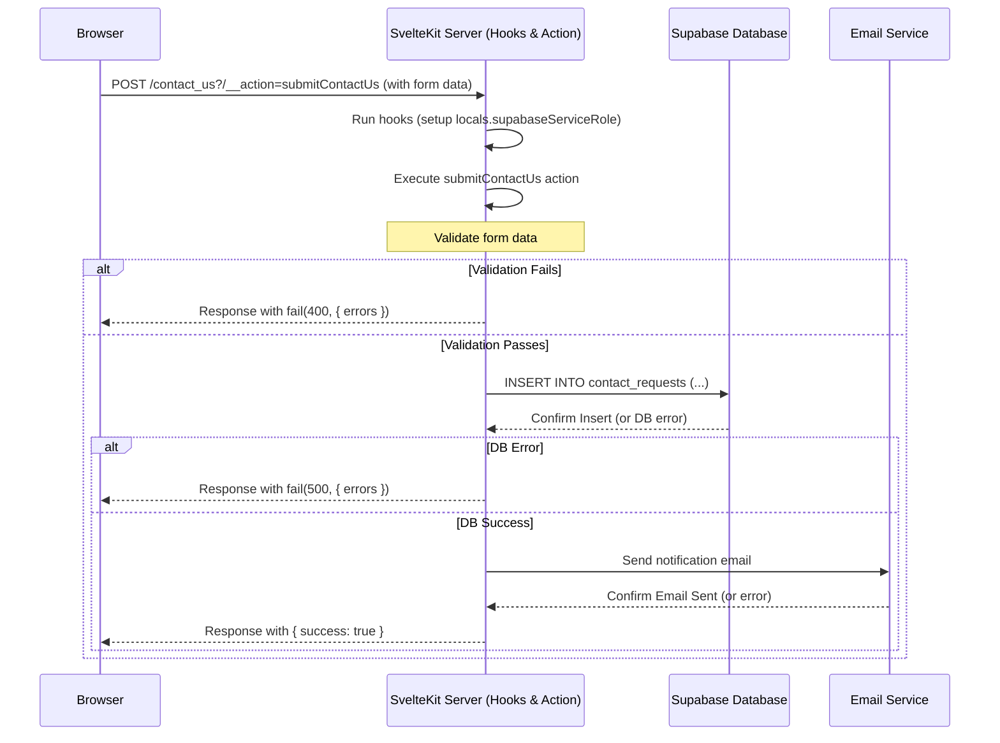

# Chapter 6: Server Hooks & API Endpoints

In [Chapter 5: Static Content & Search](05_static_content___search_.md), we learned how `CMSaasStarter` makes public pages super fast by pre-building them and performing searches directly in the browser. That's great for speed and simplicity! However, many actions require processing or security checks that _cannot_ happen in the user's browser. Think about submitting sensitive information, updating a user's profile in the database, or talking to a secure third-party service like Stripe.

This is where **Server Hooks & API Endpoints** come into play. They are the "backstage crew" and "control room" of our SvelteKit application, handling crucial tasks securely on the server.

## What's the Big Idea?

Imagine our application is a large office building.

- **Browser (Client-Side):** This is the lobby and public areas where visitors (users) interact with forms, displays, etc.
- **Server (Backend):** This is the secure part of the building – the manager's office, the secure records room, the control center.

We need a way for actions started in the public area (like filling out a contact form) to be securely processed in the back offices (on the server). Why?

1.  **Security:** We can't trust code running in a user's browser with secret keys (like our Supabase service key or Stripe key) or to perform sensitive database operations directly. Someone could easily tamper with it. Server code is protected.
2.  **Data Integrity:** We need to validate data submitted by users on the server to make sure it's correct before saving it.
3.  **Access Control:** Server code can reliably check if a user is logged in and has permission to perform an action.
4.  **Reliability:** Server code can interact with databases and external services (like sending an email) in a controlled environment.

**Use Case:** Let's consider the "Contact Us" form on our website. A visitor fills in their name, email, and message and clicks "Submit". We need the server to:

1.  Receive this information securely.
2.  Check if the required fields are filled correctly.
3.  Save the message to our Supabase database (e.g., in a `contact_requests` table).
4.  Optionally, send an email notification to our support team.
5.  Tell the visitor's browser whether the submission was successful or if there was an error.

Server Hooks and API Endpoints/Actions provide the mechanisms in SvelteKit to handle this server-side logic.

## Key Concepts

### 1. Why Server Logic is Essential

Doing everything in the browser is tempting for simplicity, but it's often insecure or impossible:

- **Secrets:** Your `PRIVATE_SUPABASE_SERVICE_ROLE` or `PRIVATE_STRIPE_API_KEY` must _never_ be visible in browser code. Server-side code can access these securely from environment variables.
- **Database Writes:** While Supabase Row Level Security ([Chapter 2: Supabase Integration (Auth & Database)](02_supabase_integration__auth___database__.md)) helps, performing critical database updates or inserts directly from the browser can be risky. Server code acts as a trusted intermediary.
- **External APIs:** Many third-party services require secret keys for communication, which must be handled on the server.
- **Complex Logic:** Some operations might be too computationally expensive or complex to run efficiently in every user's browser.

### 2. Server Hooks (`src/hooks.server.ts`): The Gatekeeper

We met Server Hooks briefly in [Chapter 2: Supabase Integration (Auth & Database)](02_supabase_integration__auth___database__.md). Think of `src/hooks.server.ts` as the main security checkpoint just inside the building's entrance. Code here runs on the server for _almost every_ request that comes into your application (whether it's for a page, a form submission, or an API call).

**What it's good for:**

- **Authentication:** Checking if a user has a valid session cookie and verifying it with Supabase Auth (`safeGetSession`).
- **Setting Up Context (`event.locals`):** Initializing things that subsequent server code might need, like the Supabase client instances (`event.locals.supabase`, `event.locals.supabaseServiceRole`) or storing the user's session (`event.locals.session`, `event.locals.user`).

```typescript
// src/hooks.server.ts (Simplified Recap)
import { createServerClient } from "@supabase/ssr"
import { createClient } from "@supabase/supabase-js"
import type { Handle } from "@sveltejs/kit"
import { sequence } from "@sveltejs/kit/hooks"
// ... import keys from $env ...

// Hook 1: Setup Supabase clients for the request
export const supabase: Handle = async ({ event, resolve }) => {
  // Create client usable with user's permissions (via cookies)
  event.locals.supabase = createServerClient(/* ... keys, cookie config ... */)

  // Create client with full admin rights (uses PRIVATE service key)
  event.locals.supabaseServiceRole =
    createClient(/* ... URL, PRIVATE key ... */)

  // Helper to securely get session and user, verifying with Supabase
  event.locals.safeGetSession = async () => {
    const {
      data: { session },
    } = await event.locals.supabase.auth.getSession()
    if (!session) return { session: null, user: null }
    // ... verify user with getUser() ... (omitted for brevity)
    return { session, user /*, amr */ }
  }

  return resolve(event) // Continue to the next hook or route handler
}

// Hook 2: Load session/user into locals for easy access later
const authGuard: Handle = async ({ event, resolve }) => {
  const { session, user } = await event.locals.safeGetSession()
  event.locals.session = session
  event.locals.user = user
  return resolve(event)
}

// Run hooks in order
export const handle: Handle = sequence(supabase, authGuard)
```

This hook ensures that for nearly every request handled by the server, we know if a user is logged in and we have the tools (`event.locals.supabase...`) ready to interact with Supabase securely.

### 3. API Endpoints (`+server.ts`): Specialized Departments

Sometimes, you need a dedicated "back office" or "service window" that just handles a specific task and returns data (often in JSON format) or performs an action without rendering a full HTML page. These are API endpoints, defined by files named `+server.ts` (or `.js`).

- The file path determines the URL (e.g., `src/routes/api/users/+server.ts` handles requests to `/api/users`).
- Inside the file, you export functions named after HTTP methods (`GET`, `POST`, `PUT`, `DELETE`, etc.).

**What they're good for:**

- Providing data for JavaScript running in the browser (e.g., fetching dynamic stats).
- Receiving data from external services (webhooks).
- Handling tasks triggered by client-side JavaScript that don't involve a standard HTML form submission.

```typescript
// Example: src/routes/api/health/+server.ts (Conceptual - Not in CMSaasStarter)
import type { RequestHandler } from "@sveltejs/kit"
import { json } from "@sveltejs/kit"

// Handles GET requests to /api/health
export const GET: RequestHandler = async () => {
  // Maybe check database connection or other internal status
  const status = "OK"
  const timestamp = new Date().toISOString()

  // Return a JSON response
  return json({ status, timestamp })
}

// Input: HTTP GET request to /api/health
// Output: HTTP Response with JSON body: { "status": "OK", "timestamp": "..." }
```

This creates a simple endpoint at `/api/health` that returns a status message. `CMSaasStarter` doesn't heavily rely on custom `+server.ts` files for its core features, preferring Form Actions for user interactions. However, it uses them for things like the Stripe webhook handler or the RSS feed (`/blog/rss.xml/+server.ts`).

### 4. Form Actions (in `+page.server.ts`): Department Forms & Drop-off Boxes

This is the primary way `CMSaasStarter` handles interactions initiated by the user through standard HTML forms (like updating their profile, changing passwords, or submitting the contact form).

- You define `actions` as a named export within a page's corresponding `+page.server.ts` file.
- Each property within the `actions` object is a function that handles a specific form submission.
- In your Svelte component (`+page.svelte`), the `<form>` tag uses the `action` attribute with a special query parameter syntax to target a specific action: `action="?/actionName"`.

**What they're good for:**

- Handling user input from forms securely on the server.
- Updating database records based on form submissions.
- Performing validation and returning specific errors back to the form.
- Keeping the form handling logic close to the page it belongs to.

**Analogy:** Think of the `actions` object as the different labeled slots ("Update Profile", "Change Password", "Contact Us") at a specific department's counter (`+page.server.ts`). When you submit a form (`<form>`) designated for a specific slot (`action="?/actionName"`), the procedure associated with that slot runs.

```typescript
// src/routes/some-page/+page.server.ts (Conceptual Structure)
import { fail } from "@sveltejs/kit"
import type { Actions } from "./$types"

export const actions: Actions = {
  // Handles forms submitted with action="?/updateSettings"
  updateSettings: async ({ request, locals }) => {
    const formData = await request.formData()
    const setting = formData.get("setting_value") as string

    // 1. Validate the input
    if (!setting || setting.length < 3) {
      return fail(400, { setting, error: "Setting must be at least 3 chars" })
    }

    // 2. Perform server-side logic (e.g., save to DB using locals.supabase)
    // const { error } = await locals.supabase.from(...).update(...);
    // if (error) return fail(500, { setting, error: "Database error" });

    // 3. Return success (or redirect)
    return { success: true, updatedSetting: setting }
  },

  // Handles forms submitted with action="?/deleteItem"
  deleteItem: async ({ request, locals }) => {
    // ... logic for deleting an item ...
  },
}
```

This structure allows a single page's server file to handle multiple related actions cleanly.

## Solving the Use Case: The Contact Us Form

Let's see how `CMSaasStarter` uses a Form Action to handle the "Contact Us" submission:

1.  **The Form (`src/routes/(marketing)/contact_us/+page.svelte`):**
    The page contains a standard HTML `<form>` that uses `method="POST"` and targets the `submitContactUs` action on the _same_ page's server logic. SvelteKit's `use:enhance` is often used for a smoother non-page-reload experience, but the core is the `action`.

    ```svelte
    <!-- src/routes/(marketing)/contact_us/+page.svelte (Simplified Form) -->
    <script lang="ts">
      // Logic to handle form state, errors (from $page.form)
      import { enhance } from "$app/forms"
      let loading = false
      // ... $page.form gives access to action results ...
    </script>

    <form
      method="POST"
      action="?/submitContactUs"
      use:enhance={() => {
        loading = true
        return async ({ update }) => {
          await update() // Update form state with results
          loading = false
        }
      }}
    >
      <label for="first_name">First Name</label>
      <input id="first_name" name="first_name" type="text" required />
      <!-- ... other fields: last_name, email, company, phone, message ... -->
      <label for="message">Message</label>
      <textarea id="message" name="message" required></textarea>

      {#if $page.form?.errors?._}
        <p class="text-error">{$page.form.errors._}</p>
      {/if}

      <button type="submit" disabled={loading}>
        {loading ? "Submitting..." : "Submit"}
      </button>
    </form>
    ```

    The key part is `action="?/submitContactUs"`. This tells SvelteKit to send the form data via POST to the `submitContactUs` action defined in the corresponding `+page.server.ts`.

2.  **The Action Handler (`src/routes/(marketing)/contact_us/+page.server.ts`):**
    This file contains the server-side logic.

    ```typescript
    // src/routes/(marketing)/contact_us/+page.server.ts
    import { fail } from "@sveltejs/kit"
    import { sendAdminEmail } from "$lib/mailer.js" // Email helper
    import type { Actions } from "./$types"

    export const actions: Actions = {
      // This function runs ONLY on the server when the form is submitted
      submitContactUs: async ({ request, locals }) => {
        // `locals` is available thanks to hooks.server.ts!
        // We need `supabaseServiceRole` for admin-level DB access
        const { supabaseServiceRole } = locals

        const formData = await request.formData()

        // --- 1. Get & Validate Data ---
        const firstName = formData.get("first_name")?.toString() ?? ""
        const email = formData.get("email")?.toString() ?? ""
        const message = formData.get("message")?.toString() ?? ""
        const errors: { [key: string]: string } = {}

        if (!firstName) errors["first_name"] = "First name is required"
        if (!email || !email.includes("@"))
          errors["email"] = "Valid email required"
        if (!message) errors["message"] = "Message is required"
        // ... more validation ...

        if (Object.keys(errors).length > 0) {
          // Return validation errors back to the browser
          return fail(400, { errors, formData }) // formData helps re-fill the form
        }

        // --- 2. Save to Database ---
        const { error: insertError } = await supabaseServiceRole
          .from("contact_requests") // Use the admin client
          .insert({
            first_name: firstName,
            email,
            message_body: message,
            // ... other fields ...
          })

        if (insertError) {
          console.error("Error saving contact request", insertError)
          return fail(500, { errors: { _: "Server error saving request." } })
        }

        // --- 3. Send Email Notification (Optional) ---
        try {
          await sendAdminEmail({
            subject: "New Contact Request",
            body: `From: ${firstName} (${email})\n\n${message}`,
          })
        } catch (emailError) {
          console.error("Failed to send contact email", emailError)
          // Decide if this is critical - maybe proceed anyway
        }

        // --- 4. Return Success ---
        return { success: true } // Indicate success back to the browser
      },
    }
    ```

    This server code safely:

    - Receives the form data (`request.formData()`).
    - Validates it. Returns specific errors using `fail(400, ...)` if invalid.
    - Uses the secure `supabaseServiceRole` client (made available by our hook in `event.locals`) to insert data into the `contact_requests` table. Returns `fail(500, ...)` on database error.
    - Calls an email function (which we'll explore in [Chapter 7: Email System (Resend)](07_email_system__resend__.md)).
    - Returns a success message (`{ success: true }`) if everything worked.

    The Svelte component (`+page.svelte`) can then use the `$page.form` store (provided by SvelteKit) to check for `errors` or `success` and update the UI accordingly.

## Under the Hood: Form Action Request Flow

Let's trace the steps when a user submits the Contact Us form:

1.  **Browser:** User fills the form and clicks "Submit".
2.  **Browser:** Sends an HTTP POST request to the _current page's URL_ (`/contact_us`) but includes the special `?/submitContactUs` marker. The form data is sent in the request body.
3.  **SvelteKit Server:** Receives the POST request.
4.  **SvelteKit Server:** Runs the server hooks (`src/hooks.server.ts`). The `supabase` hook sets up `event.locals` (including `supabaseServiceRole`). The `authGuard` hook runs (though for this public form, session/user might be null).
5.  **SvelteKit Server:** Sees the `?/submitContactUs` marker and looks for an `actions` object in `src/routes/(marketing)/contact_us/+page.server.ts`. It finds the `submitContactUs` function.
6.  **SvelteKit Server:** Executes the `submitContactUs` action function, passing `request` and `locals`.
7.  **Server Action:** The action code validates data.
8.  **Server Action -> Supabase:** If valid, it sends an `INSERT` command to the Supabase database using the secure service role client.
9.  **Supabase -> Server Action:** Supabase confirms the insert (or returns an error).
10. **Server Action -> Mailer:** (Optional) Sends instructions to the email service.
11. **SvelteKit Server:** The action function returns either `fail(...)` or `{ success: true }`.
12. **SvelteKit Server:** Sends an HTTP response back to the browser. This response contains the action result, which SvelteKit makes available to the page component via `$page.form`.
13. **Browser:** The `use:enhance` helper processes the response, updates the `$page.form` store, and the Svelte component reacts to display error messages or a success state without a full page reload.

Here's a simplified diagram:



## Conclusion

You've learned about the essential server-side components in SvelteKit:

- **Server Hooks (`src/hooks.server.ts`):** The "gatekeeper" running on most requests, ideal for authentication checks and setting up request context (`event.locals`).
- **API Endpoints (`+server.ts`):** "Specialized departments" for handling specific backend tasks or returning data (like JSON) without a full page render.
- **Form Actions (in `+page.server.ts`):** The "department forms", tightly coupled with Svelte pages, providing a clean way to handle HTML form submissions securely on the server. This is heavily used in `CMSaasStarter` for user interactions.

These server-side tools are crucial for building secure, dynamic web applications. They allow you to protect secret keys, validate user input, interact with databases safely, and integrate with other services.

One common server-side task is sending emails – for notifications, password resets, or welcome messages.

Let's move on to the final chapter, [Chapter 7: Email System (Resend)](07_email_system__resend__.md), to see how `CMSaasStarter` integrates with an email service to handle this reliably.

---

Generated by [AI Codebase Knowledge Builder](https://github.com/The-Pocket/Tutorial-Codebase-Knowledge)
