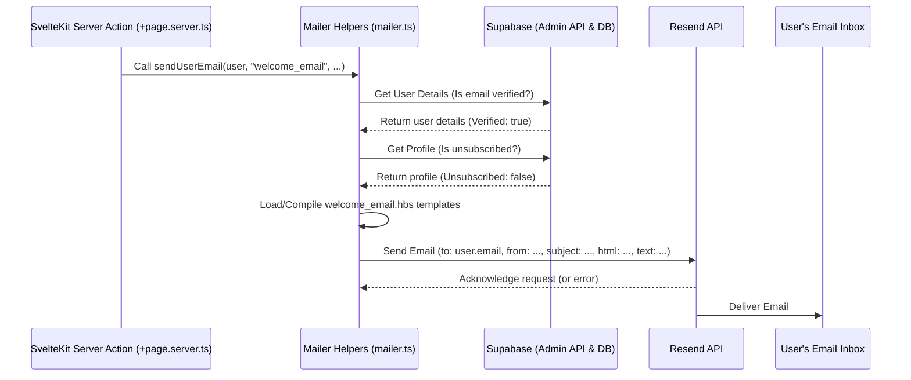

# Chapter 7: Email System (Resend)

Welcome to the final chapter of our tour through `CMSaasStarter`! In [Chapter 6: Server Hooks & API Endpoints](06_server_hooks___api_endpoints_.md), we saw how the application handles secure server-side tasks like processing form submissions. One common task that often happens on the server is sending emails. Let's see how `CMSaasStarter` manages that.

## What's the Big Idea?

Our application needs to communicate with users and administrators via email. Think about things like:

- Sending a friendly "Welcome!" message when a new user finishes setting up their profile.
- Notifying the website administrator when someone submits the "Contact Us" form.
- Potentially sending password reset instructions (though Supabase Auth often handles this directly).

Building a reliable email system from scratch is surprisingly tricky! Emails can easily get lost or marked as spam. Instead of wrestling with email servers, `CMSaasStarter` uses a professional email delivery service called **Resend**.

**Analogy: The Building's Mailroom**

Think of the email system as the mailroom in our application's building:

- **Resend Service:** A professional courier company (like FedEx or DHL) that the mailroom uses to ensure letters actually get delivered reliably and don't end up in the recipient's junk pile.
- **API Key:** The mailroom's account number and secret password to use the courier service.
- **Helper Functions:** Standard procedures the mailroom staff follow to prepare different types of mail (e.g., "Prepare Welcome Packet", "Prepare Admin Notice").
- **Email Templates (Handlebars):** Pre-designed letterheads and envelope formats for different types of mail, making them look consistent and professional. The mailroom staff just fill in the specific details (like the recipient's name) onto the template.

**Use Case:**

1.  When a new user, Chloe, finishes creating her profile, we want to automatically send her a personalized welcome email.
2.  When a visitor, David, submits the "Contact Us" form, we want to automatically send a notification email to our support team (the admin).

`CMSaasStarter` uses Resend and some helper code to handle both these scenarios reliably.

## Key Concepts

### 1. Resend: The Professional Courier

Sending email that consistently reaches the inbox (and doesn't get flagged as spam) is hard. Services like **Resend** specialize in this. They manage the technical details of email delivery, reputation, and compliance. We just tell Resend _what_ email to send and _who_ to send it to, via their API (Application Programming Interface).

Using a service like Resend dramatically increases the chances our important emails (like welcome messages or notifications) actually get delivered.

### 2. API Key (`PRIVATE_RESEND_API_KEY`)

To use Resend, we need an account with them and an **API Key**. This key is like a secret password that proves to Resend that our application is allowed to send emails through our account.

This key is highly sensitive and must be kept secure on our server. It's stored in the `.env` file (which should _not_ be committed to public repositories).

```bash
# .env.example (Reminder - Keep your real key secret!)
# ... other keys
PRIVATE_RESEND_API_KEY='re_xxxxxxxxxxxxxxx' # Your secret key from Resend
```

Our server-side code (like the code in `+page.server.ts` or `mailer.ts`) reads this key from the environment variables to authenticate with Resend.

### 3. Helper Functions (`src/lib/mailer.ts`): The Mailroom Procedures

To make sending emails easy and consistent throughout our application, `CMSaasStarter` provides helper functions inside `src/lib/mailer.ts`.

- `sendAdminEmail({ subject, body })`: Sends a simple text email to the administrator address configured in `.env`. Used for notifications.
- `sendUserEmail({ user, subject, ... })`: Sends an email to a specific application user. It automatically checks if the user's email is verified and if they haven't unsubscribed before sending. Usually uses templates.
- `sendTemplatedEmail({ to_emails, subject, template_name, template_properties, ... })`: The core function that sends emails based on templates to any list of recipients.

These helpers encapsulate the logic for interacting with the Resend API.

### 4. Email Templates (Handlebars `.hbs` files): The Letterheads

We often want our emails to look nice (HTML emails) and contain personalized information (like "Welcome, Chloe!"). `CMSaasStarter` uses **Handlebars** templates for this.

- Templates are stored in `src/lib/emails/`.
- There are usually two versions for each email type:
  - `welcome_email_html.hbs`: The fancy HTML version with formatting.
  - `welcome_email_text.hbs`: A plain text version for email clients that don't display HTML well.
- Templates use placeholders like `{{companyName}}` or `{{{WebsiteBaseUrl}}}`.

```handlebars
<!-- src/lib/emails/welcome_email_html.hbs (Snippet) -->
<p>
  Welcome to
  {{companyName}}!
</p>
<p>
  This is a quick sample of a welcome email.
</p>
```

```handlebars
{{{!-- src/lib/emails/welcome_email_text.hbs (Snippet) --}}}
Welcome to {{{companyName}}}!

This is a quick sample of a welcome email.

To unsubscribe, visit: {{{WebsiteBaseUrl}}}/account/settings/change_email_subscription
```

(Note: Handlebars uses `{{ }}` for HTML escaping and `{{{ }}}` for raw output, often needed in plain text).

When we call `sendTemplatedEmail` or `sendUserEmail`, we provide the `template_name` (e.g., "welcome_email") and `template_properties` (an object like `{ companyName: "Our Awesome App", WebsiteBaseUrl: "https://..." }`). The helper function reads the `.hbs` files, fills in the placeholders with the provided properties, and sends both the HTML and plain text versions to Resend.

### 5. Configuration (`.env` and `email_docs.md`)

Besides the `PRIVATE_RESEND_API_KEY`, you might need to set these in your `.env` file:

```bash
# .env.example (Email settings)
PRIVATE_ADMIN_EMAIL='your_support@example.com' # Where admin notifications go
PRIVATE_FROM_ADMIN_EMAIL='noreply@example.com' # 'From' address for admin emails
```

The `email_docs.md` file in the project root provides detailed instructions on setting up Resend (including domain verification, which is crucial for deliverability) and customizing the included welcome email templates.

## Solving the Use Case

Let's see how our two use cases are handled:

**1. Admin Notification for Contact Request:**

Remember the `submitContactUs` action from [Chapter 6: Server Hooks & API Endpoints](06_server_hooks___api_endpoints_.md)? After saving the contact request to the database, it calls `sendAdminEmail`:

```typescript
// src/routes/(marketing)/contact_us/+page.server.ts (Inside submitContactUs action)

// ... after saving to database ...

// Send email to admin
await sendAdminEmail({
  subject: "New contact request",
  body: `New contact request from ${firstName} ${lastName}.\n\nEmail: ${email}\n\nMessage: ${message}`,
})

// ... return success ...
```

This code snippet calls the helper function `sendAdminEmail`, providing a subject line and the email body constructed from the form data. The helper function takes care of sending this simple text email to the `PRIVATE_ADMIN_EMAIL` address using Resend.

**2. Welcome Email for New User:**

In [Chapter 6](06_server_hooks___api_endpoints_.md), we also saw the `updateProfile` action in `src/routes/(admin)/account/api/+page.server.ts`. This action runs when a user saves their profile (often for the first time). The code checks if the profile was just created and, if so, calls `sendUserEmail`:

```typescript
// src/routes/(admin)/account/api/+page.server.ts (Inside updateProfile action)

// ... after successfully saving the profile ...

// Check if this was the *first* time the profile was saved
const newProfile =
  priorProfile?.updated_at === null && priorProfileError === null

if (newProfile) {
  // Send notification to admin (omitted for brevity)
  // await sendAdminEmail({ ... });

  // Send welcome email to the USER
  await sendUserEmail({
    user: session.user, // The user object from Supabase Auth
    subject: "Welcome!", // Email subject line
    from_email: "no-reply@saasstarter.work", // 'From' address (configure yours!)
    template_name: "welcome_email", // Use welcome_email_html.hbs & welcome_email_text.hbs
    template_properties: {
      // Data to fill into the templates
      companyName: "SaaS Starter", // Customize this!
      WebsiteBaseUrl: WebsiteBaseUrl, // Base URL for links (e.g., unsubscribe)
    },
  })
}

// ... return success ...
```

This snippet calls `sendUserEmail`. It passes the `user` object (so the helper can get the recipient's email address and check verification/unsubscribe status), the subject, a 'from' address, the name of the template ("welcome_email"), and the data needed by the template (`template_properties`). The helper function then uses `sendTemplatedEmail` internally to generate the email from the `.hbs` files and send it via Resend.

## Under the Hood

Let's peek inside the mailroom (`src/lib/mailer.ts`) and see how the helpers work.

### Code Walkthrough (`mailer.ts` Simplified)

**`sendAdminEmail`:**

```typescript
// src/lib/mailer.ts (Simplified sendAdminEmail)
import { Resend } from "resend"
import { env } from "$env/dynamic/private" // Access .env variables

export const sendAdminEmail = async ({ subject, body }) => {
  // 1. Check if admin email is configured in .env
  if (!env.PRIVATE_ADMIN_EMAIL) {
    console.log("Admin email not set, skipping.")
    return
  }
  // 2. Check if Resend key is configured
  if (!env.PRIVATE_RESEND_API_KEY) {
    console.log("Resend key not set, skipping.")
    return
  }

  try {
    // 3. Initialize Resend client with API key
    const resend = new Resend(env.PRIVATE_RESEND_API_KEY)

    // 4. Send the email via Resend API
    const resp = await resend.emails.send({
      from: env.PRIVATE_FROM_ADMIN_EMAIL || env.PRIVATE_ADMIN_EMAIL, // 'From' address
      to: [env.PRIVATE_ADMIN_EMAIL], // 'To' address (admin)
      subject: "ADMIN_MAIL: " + subject, // Add prefix to subject
      text: body, // Plain text body
    })

    // 5. Log errors if any
    if (resp.error) {
      console.error("Resend error:", resp.error)
    }
  } catch (e) {
    console.error("Error sending admin email:", e)
  }
}
```

This function is straightforward: it checks configuration, creates a Resend client object using the secret key, and calls `resend.emails.send` with the necessary details for a simple text email.

**`sendTemplatedEmail`:** (The core logic used by `sendUserEmail`)

```typescript
// src/lib/mailer.ts (Simplified sendTemplatedEmail)
import handlebars from "handlebars"
// ... other imports ...

export const sendTemplatedEmail = async ({
  subject,
  to_emails,
  from_email,
  template_name,
  template_properties,
}) => {
  // 1. Check Resend key
  if (!env.PRIVATE_RESEND_API_KEY) {
    return
  }

  let plaintextBody: string | undefined
  try {
    // 2. Import the plain text template (.hbs file)
    const textTemplate = await import(
      `./emails/${template_name}_text.hbs?raw`
    ).then((mod) => mod.default)
    // 3. Compile template and fill placeholders
    const template = handlebars.compile(textTemplate)
    plaintextBody = template(template_properties)
  } catch (e) {
    /* ignore if text template missing */
  }

  let htmlBody: string | undefined
  try {
    // 4. Import the HTML template (.hbs file)
    const htmlTemplate = await import(
      `./emails/${template_name}_html.hbs?raw`
    ).then((mod) => mod.default)
    // 5. Compile template and fill placeholders
    const template = handlebars.compile(htmlTemplate)
    htmlBody = template(template_properties)
  } catch (e) {
    /* ignore if html template missing */
  }

  // 6. Must have at least one body (HTML or text)
  if (!plaintextBody && !htmlBody) {
    return
  }

  try {
    // 7. Initialize Resend client
    const resend = new Resend(env.PRIVATE_RESEND_API_KEY)
    // 8. Prepare email data (including both text and html if available)
    const email = { from: from_email, to: to_emails, subject /*...*/ }
    if (plaintextBody) {
      email.text = plaintextBody
    }
    if (htmlBody) {
      email.html = htmlBody
    }

    // 9. Send via Resend API
    const resp = await resend.emails.send(email)
    if (resp.error) {
      console.error("Resend error:", resp.error)
    }
  } catch (e) {
    console.error("Error sending templated email:", e)
  }
}
```

This function does more work: it dynamically imports the `.hbs` template files based on `template_name`, uses the `handlebars` library to compile them and insert the `template_properties`, and then sends both the HTML and plain text versions to Resend.

**`sendUserEmail`:**

```typescript
// src/lib/mailer.ts (Simplified sendUserEmail)
import { createClient } from "@supabase/supabase-js"
// ... other imports ...

export const sendUserEmail = async ({
  user,
  subject,
  from_email,
  template_name,
  template_properties,
}) => {
  // 1. Get user's email
  const email = user.email
  if (!email) {
    return
  }

  // 2. IMPORTANT: Check if email is verified using admin client
  // (Connects directly to Supabase with SERVICE_ROLE key)
  const serverSupabase = createClient(
    PUBLIC_SUPABASE_URL,
    PRIVATE_SUPABASE_SERVICE_ROLE,
    {
      /* ... */
    },
  )
  const { data: serviceUserData } = await serverSupabase.auth.admin.getUserById(
    user.id,
  )
  const emailVerified =
    serviceUserData.user?.email_confirmed_at /* ... or OAuth check ... */
  if (!emailVerified) {
    return
  } // Don't email unverified addresses

  // 3. IMPORTANT: Check if user unsubscribed via 'profiles' table
  const { data: profile } = await serverSupabase
    .from("profiles")
    .select("unsubscribed")
    .eq("id", user.id)
    .single()
  if (profile?.unsubscribed) {
    return
  } // Respect unsubscribe requests

  // 4. Call sendTemplatedEmail with all the details
  await sendTemplatedEmail({
    subject,
    to_emails: [email],
    from_email,
    template_name,
    template_properties,
  })
}
```

This function acts as a crucial gatekeeper before calling `sendTemplatedEmail`. It uses the secure `supabaseServiceRole` client (see [Chapter 6](06_server_hooks___api_endpoints_.md) and [Chapter 2](02_supabase_integration__auth___database__.md)) to check the user's _actual_ verification status directly from Supabase and also checks the `unsubscribed` flag in their profile. This prevents sending emails to potentially fake addresses or users who have opted out.

### Sequence Diagram: Sending a Welcome Email

Here's a simplified flow of what happens when the `updateProfile` action calls `sendUserEmail`:



This shows the journey: the server action triggers the mailer, which checks permissions/preferences with Supabase, prepares the email content using templates, and finally tells Resend to handle the actual delivery.

## Conclusion

Congratulations! You've reached the end of the `CMSaasStarter` tutorial. In this chapter, you learned how the application handles sending emails reliably:

- It uses **Resend**, a third-party service, to manage email deliverability, configured via `PRIVATE_RESEND_API_KEY`.
- Helper functions in `src/lib/mailer.ts` (`sendAdminEmail`, `sendUserEmail`, `sendTemplatedEmail`) provide a simple interface for sending different types of emails.
- **Handlebars templates** (`.hbs` files) allow for creating reusable and dynamic HTML and plain text email content.
- Crucially, `sendUserEmail` checks for **email verification** and **unsubscribe status** before sending, ensuring compliance and good practice.
- Sending emails happens on the **server-side** (usually triggered from Actions in `+page.server.ts`), protecting the Resend API key.

This email system is the final core component we've explored in `CMSaasStarter`. You've now seen how routing, database integration, authentication, account management, billing, static content, server-side logic, and email all fit together to form the foundation of a modern SaaS application.

From here, you can dive deeper into the specific code files mentioned in each chapter, customize the components to fit your unique SaaS idea, and start building your own features on top of this solid starter project. Good luck!

---

Generated by [AI Codebase Knowledge Builder](https://github.com/The-Pocket/Tutorial-Codebase-Knowledge)
