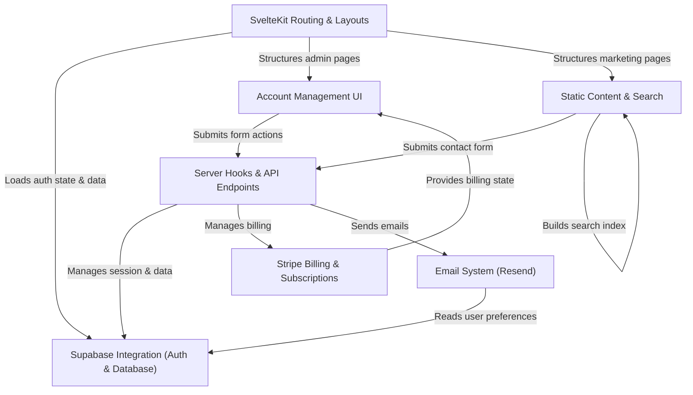

# Tutorial: CMSaasStarter

CMSaasStarter is a **SvelteKit** project template designed to help developers quickly build _Software-as-a-Service (SaaS)_ applications.
It provides pre-built features like **user authentication** and database management using _Supabase_, **subscription billing** with _Stripe_, a static marketing site with a **blog** and search, an **account management dashboard**, and an **email sending** system using _Resend_.
It aims to be performant, easy to host (often for free initially), and extensible.

**Source Repository:** [None](None)

## Chapters

1. [SvelteKit Routing & Layouts
   ](01_sveltekit_routing___layouts_.md)
2. [Supabase Integration (Auth & Database)
   ](02_supabase_integration__auth___database__.md)
3. [Account Management UI
   ](03_account_management_ui_.md)
4. [Stripe Billing & Subscriptions
   ](04_stripe_billing___subscriptions_.md)
5. [Static Content & Search
   ](05_static_content___search_.md)
6. [Server Hooks & API Endpoints
   ](06_server_hooks___api_endpoints_.md)
7. [Email System (Resend)
   ](07_email_system__resend__.md)

---

Generated by [AI Codebase Knowledge Builder](https://github.com/The-Pocket/Tutorial-Codebase-Knowledge)
